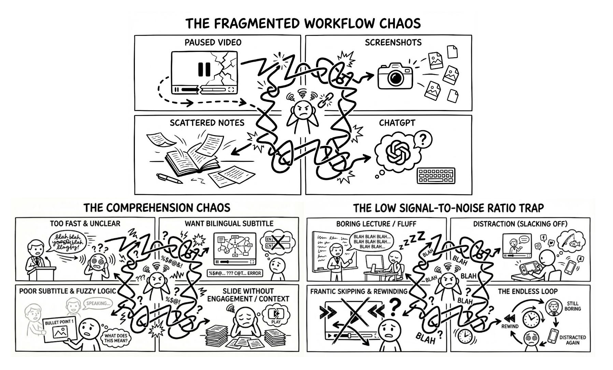
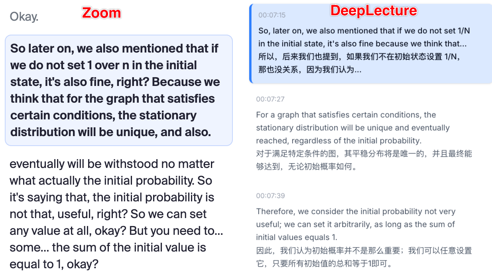
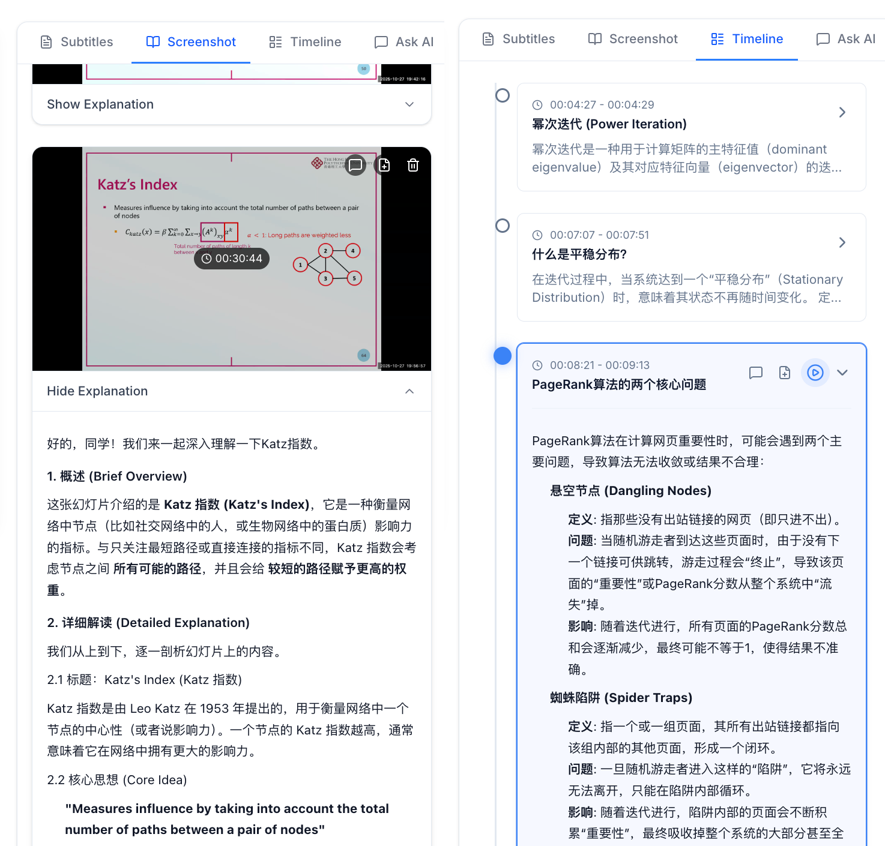
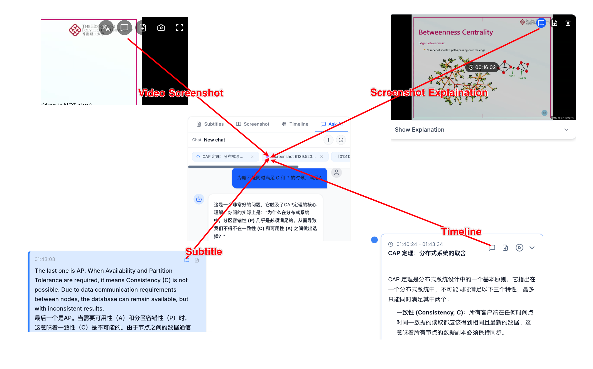

# DeepLecture

> **用 AI 解锁视频学习的全部潜力**

**DeepLecture** 是一个开源的、AI 原生的视频学习平台，旨在弥合内容与理解之间的鸿沟。

## 为什么需要 DeepLecture?



## 解决方案: DeepLecture

#### 1. 双语字幕



使用本地/云端高精度模型进行视频转录，并用 LLM 进行上下文感知的翻译。

- **双语字幕**：同时显示原文和译文
- **时间轴同步**：点击任意字幕即可跳转到对应时刻

---

#### 2. 视频截图解释



遇到复杂的幻灯片或图表卡住了?
- **截图分析**：AI "看到"你所看到的内容，对当前画面进行解释
- **保存所有解释**：所有的截图解释存储在当前视频的 Screenshot 记录中，哪一天复习也能轻松找到

---

#### 3. 时间线节点

让 AI 把一整门课拆成「关键片段」时间线。

- 自动从字幕里识别知识点，生成可点击的时间线节点
- 会参考你的学习偏好，只为你需要的生成节点
- 提前浏览视频内容，跳过已经掌握的节点，跳转要观看的节点，不用担心错过重要内容

---

#### 4. 智能跳过

在不剪视频的前提下，用 AI 自动略过「水分」。

- 开启 Smart Skip 后，只在时间线标记的高价值片段停留
- 闲聊、重复说明自动快进，随时可以一键关闭恢复完整播放

---

#### 5. 摸鱼总结


---

#### 6. 任何地方询问 LLM 任何内容



AI 会结合视频上下文窗口（可以在设置中调节）回答问题

---

#### 7. 任何地方将任何内容加到笔记

播放器下方直接就是 Markdown 笔记区，边看边记不打断心流。

- 一节视频一份笔记，自动保存到本地
- 支持 WYSIWYG（Typora-like），可以直接带格式粘贴和图片粘贴
- 点一下按钮，就可以将 Screenshot / Subtitle / Explanation / Timeline / AI Answer 添加到笔记

---

#### 8. AI 配音

把一门外语课「换成你喜欢的声音 / 语言」

- 自动跟画面 & 字幕对齐
- 一键在原声和多个 AI 配音版本之间切换
- 支持 Fish Audio、Edge-TTS 等多种 TTS 引擎

---

#### 9. 基于课件生成 AI Lecture（实验性功能）

- 只需上传你的课件（PDF），无需视频，自动生成课件讲解视频
- AI 会根据课件内容生成讲解脚本，并合成语音和视频

---

## 技术栈

| 层级 | 技术 |
|------|------|
| **后端** | Flask (Python 3.10+) |
| **前端** | Next.js 16 + React 19 + TypeScript |
| **样式** | Tailwind CSS 4 |
| **状态管理** | Zustand |
| **ASR 引擎** | Whisper.cpp (macOS/Linux) / Faster-whisper (Windows) |
| **TTS 引擎** | Fish Audio, Edge-TTS |
| **LLM** | OpenAI 兼容 API（支持任何兼容端点） |

## 🖥️ 跨平台支持

DeepLecture 支持所有主流操作系统：

| 平台 | 推荐引擎 | 特点 |
|------|---------|------|
| **macOS** | Whisper.cpp | Metal GPU 加速，自动编译和下载模型 |
| **Windows** | Faster-whisper | 无需编译，支持 CUDA 加速 |
| **Linux** | 两者皆可 | 需在配置中手动选择引擎 |

> 选定引擎后，系统会自动检测硬件（Metal/CUDA/CPU）并优化运行参数。

## 快速开始

### 环境要求

- Python 3.10+
- Node.js 18+
- [uv](https://docs.astral.sh/uv/)（Python 包管理器）
- FFmpeg（用于音视频处理）
- Git（用于自动克隆 whisper.cpp）
- CMake（macOS/Linux，用于自动编译 whisper.cpp）

### 1. 克隆仓库

```bash
git clone https://github.com/your-username/DeepLecture.git
cd DeepLecture
```

### 2. 安装依赖

**后端**：
```bash
uv sync

# Windows 用户需要额外安装 faster-whisper
uv sync --extra faster-whisper
```

**前端**：
```bash
cd frontend && npm install && cd ..
```

### 3. 配置

复制默认配置文件：

```bash
cp config/conf.default.yaml config/conf.yaml
```

编辑 `config/conf.yaml`，配置 LLM（必需）：

```yaml
llm:
  models:
    - name: default
      provider: openai          # 或 gemini
      model: gpt-4.1            # 或其他兼容模型
      api_key: "your-api-key"
      base_url: "https://api.openai.com/v1"
  task_models:
    default: default            # 所有任务使用 default 模型

# ASR 引擎配置（可选，默认自动处理）
subtitle:
  engine: whisper_cpp           # macOS/Linux 推荐
  # engine: faster_whisper      # Windows 推荐
  whisper_cpp:
    model_name: large-v3-turbo  # 推荐。可选: tiny, base, small, medium, large-v2, large-v3, large-v3-turbo
    auto_download: true         # 自动下载模型和编译 whisper.cpp

# TTS 配置（可选，用于 AI 配音功能）
tts:
  providers:
    - name: edge-default
      provider: edge_tts
      edge_tts:
        voice: zh-CN-XiaoxiaoNeural
```

### 4. 启动服务

**启动后端**（端口 11393）：
```bash
uv run deeplecture
```

**启动前端**（新终端，端口 3000）：

```bash
cd frontend && npm run dev
```

访问 http://localhost:3000 开始使用。

> **注意**：首次使用字幕功能时，系统会自动下载 Whisper 模型（large约 1.5GB），请耐心等待。

## 项目结构

```
DeepLecture/
├── src/deeplecture/       # Python 后端源码
│   ├── api/               # Flask API 路由
│   ├── services/          # 业务逻辑层
│   ├── transcription/     # ASR 引擎 (whisper_engine, faster_whisper_engine)
│   ├── llm/               # LLM 抽象层 (OpenAI, Gemini)
│   ├── tts/               # TTS 抽象层 (Fish Audio, Edge-TTS)
│   ├── config/            # 配置管理 (Pydantic Settings)
│   ├── storage/           # 数据持久化
│   └── app.py             # Flask 入口
├── frontend/              # Next.js 前端
│   ├── app/               # 页面路由
│   ├── components/        # React 组件
│   ├── stores/            # Zustand 状态管理
│   └── lib/               # API 客户端
├── config/                # YAML 配置文件
├── whisper.cpp/           # Whisper.cpp 子模块（自动管理）
└── data/                  # 运行时数据（自动创建）
```

## 配置说明

详细配置选项请参考 `config/conf.default.yaml`，主要配置项包括：

| 配置项 | 说明 |
|--------|------|
| `llm.models` | LLM 模型列表，支持 OpenAI 兼容 API 和 Gemini |
| `llm.task_models` | 为不同任务指定模型（翻译、问答、时间线等） |
| `subtitle.engine` | ASR 引擎：`whisper_cpp` 或 `faster_whisper` |
| `subtitle.whisper_cpp.model_name` | 模型：tiny/base/small/medium/large-v2/large-v3/large-v3-turbo（推荐） |
| `subtitle.whisper_cpp.auto_download` | 是否自动下载模型和编译（默认 true） |
| `tts.providers` | TTS 引擎配置（Fish Audio、Edge-TTS） |

## 数据存储

所有数据存储在 `data/` 目录下（可通过 `app.data_dir` 配置）：

```
data/
├── db/           # SQLite 数据库
├── content/      # 视频、字幕、笔记等内容（按 content_id 组织）
├── temp/         # 临时文件
└── logs/         # 应用日志
```

## Roadmap

我们正在积极开发以下功能，欢迎贡献代码或提出建议！

### 🔴 高优先级

- [ ] `Feature:` **学习统计仪表盘** - 观看时长、学习天数、完成进度等数据可视化
- [ ] `Feature:` **任务统计** - 转录/翻译/配音任务耗时、LLM Token 消耗量追踪
- [ ] `Feature:` **字幕全局搜索** - 跨视频搜索字幕内容，快速定位知识点
- [ ] `Feature:` **内容导出** - 字幕导出 (SRT/VTT)、嵌入字幕的视频导出
- [ ] `Enhancement:` **Prompt & Workflow 优化** - 优化现有任务的提示词和处理流程
- [ ] `Integration:` **更多 TTS 引擎** - OpenAI TTS、Azure Neural TTS、ElevenLabs
- [ ] `DevOps:` **Docker 部署** - 一键部署、GPU passthrough 支持

### 🟡 中优先级

- [ ] `Feature:` **课程组织** - 课程 > 章节 > 视频的层级管理
- [ ] `Feature:` **标签系统** - 给视频打标签、按标签筛选
- [ ] `Feature:` **收藏夹** - 收藏重要视频或片段
- [ ] `Feature:` **视频拖拽排序** - 自定义视频列表顺序
- [ ] `Feature:` **Flashcard 闪卡** - 基于时间线节点生成记忆卡片
- [ ] `Feature:` **Quiz 小测验** - AI 根据视频内容生成测验题
- [ ] `Feature:` **Cheatsheet 速查表** - 自动提取关键概念生成速查表
- [ ] `Feature:` **学习报告 Report** - 生成学习总结报告
- [ ] `Feature:` **Podcast 模式** - 将视频转为纯音频播客格式
- [ ] `Enhancement:` **笔记生成优化** - 更智能的 AI 笔记生成
- [ ] `UI:` **移动端适配** - 响应式布局、触摸友好

### 🟢 待定 / 探索中

- [ ] `Feature:` **Live2D 虚拟讲师** - 口型同步、表情响应、多模型切换
- [ ] `Integration:` **Obsidian 集成** - 双向同步笔记、知识图谱联动
- [ ] `Performance:` **性能优化** - CPU 密集任务优化、并行处理、缓存策略
- [ ] `UI:` **其他 UI/UX 增强** - 快捷键、主题定制、无障碍优化

---

> 💡 有想法或建议？欢迎 [提交 Issue](https://github.com/your-username/DeepLecture/issues) 或 [参与讨论](https://github.com/your-username/DeepLecture/discussions)！

## License

MIT License
