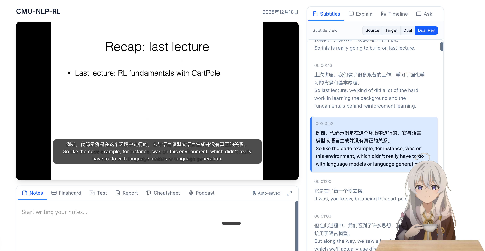
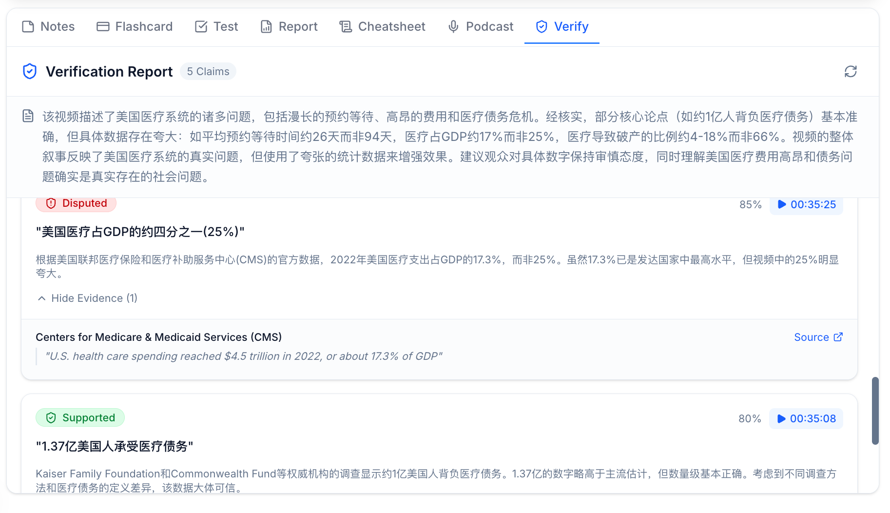
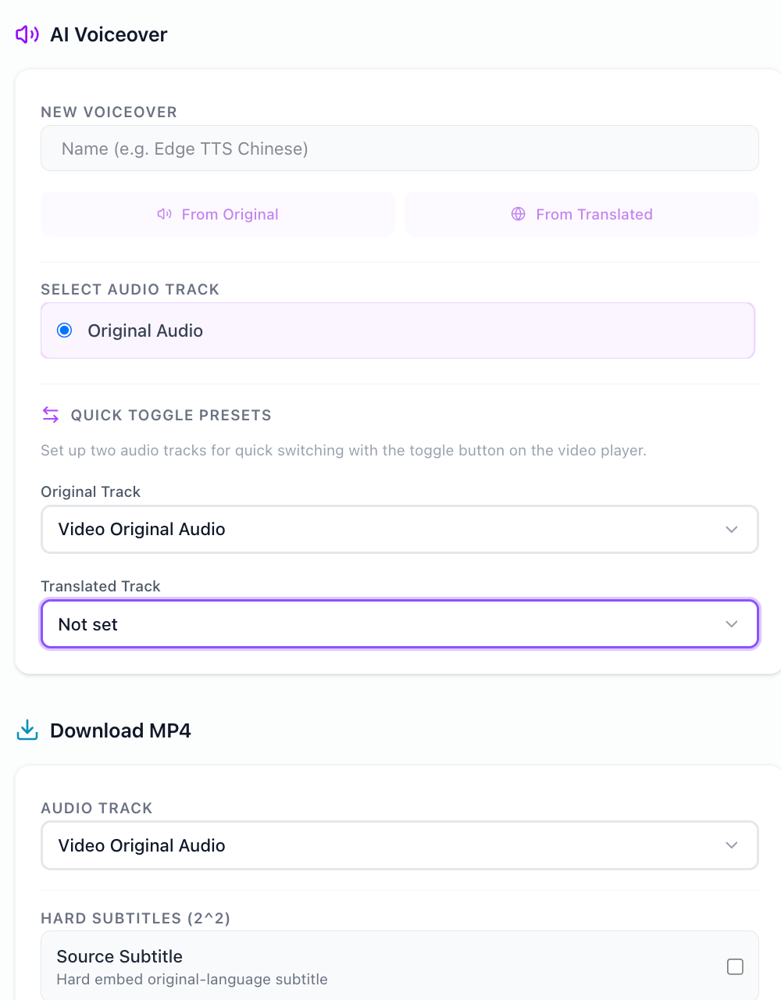
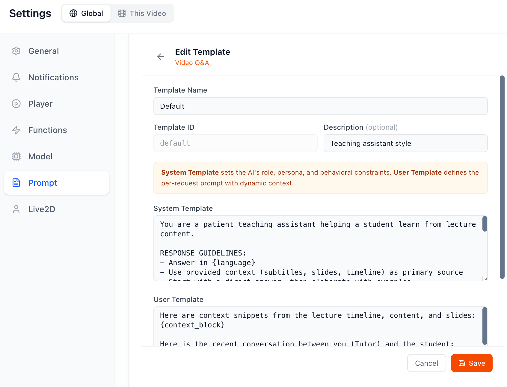

# DeepLecture

> **开源 AI 视频学习平台——从「听懂」到「学会」，一站式自部署。**

看网课时需要在视频播放器、翻译工具、ChatGPT、笔记软件之间反复切换。DeepLecture 把**字幕翻译、截图解释、AI 问答、学习资料生成**整合到一个播放器里，开源自部署，数据完全在本地。

---

## 为什么需要 DeepLecture？

看网课时，你是不是也经历过这些？

<p align="center">
  
</p>
**暂停截图、切 ChatGPT 问问题、手动做笔记、信息密度太低、走神还得倒回去、老师发音不清……** DeepLecture 把这一切的解决方案整合到了一个平台里。

<p align="center">
  
</p>

<p align="center"><em>双语字幕 · Live2D 伴学 · 笔记/闪卡/Quiz/试卷/Cheatsheet/播客 一键生成</em></p>

---

## Highlights

🎙️ **AI 配音** — 把老师的声音换成你喜欢的角色、甚至你自己的声音来给你讲课。听不懂英文授课？换成中文配音。听不懂粤语？换成普通话。一个视频可以生成多条配音轨道，播放时一键切换。配音后视频总时长会变化，播放器通过智能变速自动对齐画面，不需要手动调整。同类开源工具（VideoLingo、KrillinAI）仅支持单轨，且无法导出。

🔤 **字幕增强翻译** — Whisper 转录的原始字幕有断句错误和识别噪音。DeepLecture 先提取全文术语表和主题上下文，修正 ASR 错误后再翻译——翻译时知道整节课在讲什么，而不是逐句硬译。支持源语言 / 目标语言 / 双语 / 双语反转四种视图。

📸 **截图即解释** — 看到不懂的图表或公式，不用暂停视频切到 ChatGPT 再粘贴截图描述上下文。直接在播放器内截图，AI 自动获取前后字幕作为上下文，给出解释。**目前没有同类产品提供这个功能。**

⏭️ **智能跳过 & 专注模式** — 一小时的课可能只有 40 分钟是干货。AI 基于时间线标记出闲聊和重复内容，自动快进。切到别的标签页时自动暂停，回来弹窗告诉你错过了哪些内容，可以一键跳回、提问或加笔记。**目前没有同类产品提供这个功能。**

🔍 **事实核查** — 讲座内容不一定准确。AI 自动提取讲座中的关键声明，对照权威来源逐条验证，生成带证据链接的核查报告。每条标注 Supported / Disputed 及置信度。**目前没有同类产品提供这个功能。**

📚 **学习资料生成** — 闪卡、Quiz、试卷、Cheatsheet、播客、AI 笔记——从视频内容生成，不需要在多个工具之间切换。其中试卷和 Cheatsheet 是同类产品（NotebookLM、NoteGPT）没有的。

---

## 从导入到学习，三步搞定

<p align="center">
  
</p>

粘贴视频链接或本地上传 → 一键生成双语字幕 → 打开播放器，所有学习工具都在手边。

---

## 功能展示

### 🔤 字幕增强翻译

<p align="center">
  
</p>

左：Zoom 自动字幕——断句随机，没有翻译。右：DeepLecture 增强双语字幕——AI 先建立术语表和上下文再翻译，断句跟随语义而非时间窗口。

### 📸 截图解释 · 时间线 · AI 问答

<p align="center">
  
</p>

- **截图解释**：在播放器内直接截图，AI 自动关联前后字幕上下文生成解释，不需要切到外部工具再手动描述上下文
- **时间线**：AI 按语义（而非固定时间间隔）拆分知识点，每个节点附详细解释，点击跳转
- **AI 问答**：提问时自动携带字幕、截图、时间线上下文，不需要手动粘贴

### 🔍 事实核查 & ⏸️ 专注模式

<table>
<tr>
<td width="50%">

<p align="center">
  
</p>

**事实核查** — 讲座中的数据和结论不一定准确。AI 提取关键声明，对照权威来源逐条验证，标注 Supported / Disputed 及置信度，附原始证据链接。

</td>
<td width="50%">

<p align="center">
  
</p>

**专注模式** — 切走标签页自动暂停。回来时弹窗总结你离开期间的内容，可以跳回离开位置、生成详细总结、或直接继续。

</td>
</tr>
</table>

### 🎙️ AI 配音 & 视频导出

<p align="center">
  
</p>

多语言多声音配音，支持多轨管理和一键切换。配音时长和原始画面不一致时，播放器自动变速画面来保持同步。导出 MP4 时可自选音轨（原音/配音）和字幕方案（单语/双语/硬嵌入）。

### ⚙️ 可定制的 AI 行为

<p align="center">
  
</p>

LLM 模型、Prompt 模板、TTS 声音均可按需配置。支持全局 → 单个视频 → 单个任务三层覆盖——比如字幕翻译用 GPT-4o 追求质量，Quiz 生成用更便宜的模型控制成本。

---

## 功能一览

### 🎬 看懂视频
- **双语字幕** — Whisper 转录 + LLM 上下文增强翻译，点击字幕跳转
- **时间线知识点** — AI 按语义拆分知识点（非简单时间切割），每个节点附详细解释
- **智能跳过** — 基于时间线自动快进废话段落
- **专注模式** — 离开自动暂停，回来弹窗总结错过的内容，可一键跳回/提问/加笔记
- **截图解释** — 截图 + 周围字幕上下文 → AI 即时解释，自动保存
- **内置词典** — 悬停/点击字幕查词，发音、释义、一键收藏生词本

### 🎙️ 换个声音听
- **AI 配音** — 多语言/多声音配音，智能音频对齐（画面自动变速）
- **多轨管理** — 一个视频多条配音轨道，播放时自由切换，离开自动切回原音
- **课件生成视频** — PDF 幻灯片 → AI 讲解脚本 + 配音 → 带字幕的完整讲座视频
- **视频导出** — 下载时自选音轨（原音/配音）+ 字幕（单语/双语/不烧录）

### 📚 学习巩固
- **AI 问答** — 一键提问，自动携带时间线/字幕/截图上下文，多轮对话
- **笔记** — WYSIWYG 编辑器 + KaTeX 公式，边看边记，也可 AI 一键生成
- **书签** — 视频任意位置打标记，进度条直接显示
- **闪卡** — AI 生成，按重要性（高/中/低）过滤，区分 STEM / 人文
- **Quiz** — AI 生成选择题，可控题量、难度、关注方向
- **试卷** — 完整考试级试卷生成
- **Cheatsheet** — 1-10 页浓缩速查表，可编辑
- **事实核查** — AI 验证讲座中的声明，生成核查报告

### 🎧 听着学
- **播客** — 讲座转双人对谈播客（主持人 + 嘉宾），可分别设置声音
- **朗读笔记** — 流式 TTS 逐句朗读，实时高亮当前句子
- **Live2D 伴学** — 屏幕上 Live2D 角色，嘴型与音频同步

### ⚙️ 个性化
- **Learner Profile** — 设置学习者画像，影响所有 AI 输出的深度和风格
- **项目管理** — 视频按项目分组，自定义颜色和图标
- **层级配置** — 全局 → 内容 → 任务三层覆盖，不同任务可用不同 LLM/TTS 模型

## 与同类产品对比

|  | DeepLecture | [VideoLingo](https://github.com/Huanshere/VideoLingo) | [KrillinAI](https://github.com/krillinai/KrillinAI) | [NotebookLM](https://notebooklm.google.com) | [NoteGPT](https://notegpt.io) | [Mindgrasp](https://mindgrasp.ai) |
|--|:-----------:|:----------:|:---------:|:----------:|:-------:|:---------:|
| **字幕增强翻译** | ✅ 上下文感知 | ✅ 三步翻译 | ✅ | - | - | - |
| **智能跳过 & 专注模式** | ✅ | - | - | - | - | - |
| **截图解释** | ✅ | - | - | - | - | - |
| **AI 配音 (多轨切换)** | ✅ 画面变速 | ✅ 单轨 | ✅ 单轨 | - | - | - |
| **PDF → 讲座视频** | ✅ 跨语言 | - | - | - | - | - |
| **笔记 / 闪卡 / Quiz** | ✅ | - | - | ✅ | ✅ | ✅ |
| **试卷 / Cheatsheet** | ✅ | - | - | - | - | - |
| **播客生成** | ✅ 双人对谈 | - | - | ✅ 4 格式 | ✅ | - |
| **事实核查** | ✅ | - | - | - | - | - |
| **Live2D 伴学** | ✅ | - | - | - | - | - |
| **思维导图** | 🔜 | - | - | ✅ | ✅ | - |
| **开源 / 自部署** | ✅ MIT | ✅ Apache | ✅ GPL | - | - | - |
| **自选 LLM / TTS** | ✅ 按任务分配 | ✅ | ✅ | - | 部分 | - |
| **价格** | 免费 | 免费 | 免费 | $0-250/月 | $0-99/月 | $10-15/月 |

## 跨平台支持

| 平台 | 推荐引擎 | 特点 |
|------|---------|------|
| **macOS** | Whisper.cpp | Metal GPU 加速，自动编译和下载模型 |
| **Windows** | Faster-whisper | 无需编译，支持 CUDA 加速 |
| **Linux** | 两者皆可 | *未测试 |

> 选定引擎后，系统会自动检测硬件（Metal/CUDA/CPU）并优化运行参数。

## 快速开始

### 环境要求

- Python 3.10+
- Node.js 18+
- [uv](https://docs.astral.sh/uv/)（Python 包管理器）
- FFmpeg（用于音视频处理）
- Git

### 1. 克隆仓库

```bash
git clone https://github.com/ylxmf2005/DeepLecture.git
cd DeepLecture
```

### 2. 一条命令启动

```bash
npm start
```

首次运行时，这个命令会自动完成：

- 后端依赖同步
- `frontend/` 依赖安装
- 自动创建 `config/conf.yaml`（如果还没有）
- 同时启动后端 API 和前端界面

启动后会拉起：

- 后端 API：`http://localhost:11393`
- 前端界面：`http://localhost:3001`

访问 http://localhost:3001 开始使用。

> **注意**：首次使用字幕功能时，系统会自动下载 Whisper 模型（large-v3-turbo 约 1.5GB），请耐心等待。
>
> 首次运行后如果需要接入真实模型，请编辑 `config/conf.yaml` 填入 API Key，然后继续执行同一个 `npm start`。
>
> Windows 用户如果要切到 `faster-whisper`，可以先手动执行一次 `uv sync --extra faster-whisper`。

### 3. 单独开发前端

正常情况下**不需要**再手动执行 `cd frontend && npm run dev`。只有在单独开发前端时，才需要：

```bash
cd frontend
npm run dev
```

## Roadmap

### 高优先级

- [ ] `DevOps:` **Docker 部署** - 一键部署、GPU passthrough 支持
- [ ] `Feature:` **内容导出增强** - SRT/VTT 字幕文件独立导出
- [ ] `Enhancement:` **笔记生成优化** - 笔记中嵌入课程截图
- [ ] `Feature:` **思维导图** - AI 生成交互式知识结构图

### 中优先级

- [ ] `Enhancement:` **Slide Lecture 增强** - AI 标注幻灯片，插入 AI 生成的插图
- [ ] `Feature:` **学习统计仪表盘** - 观看时长、完成进度等可视化
- [ ] `Feature:` **字幕全局搜索** - 跨视频搜索字幕内容
- [ ] `Feature:` **学习报告** - 阶段性学习总结
- [ ] `UI:` **移动端适配** - 响应式布局
- [ ] `Performance:` **性能优化**

## Contributing

有想法或建议？欢迎 [提交 Issue](https://github.com/ylxmf2005/DeepLecture/issues) 或 [参与讨论](https://github.com/ylxmf2005/DeepLecture/discussions)！

## License

MIT License
