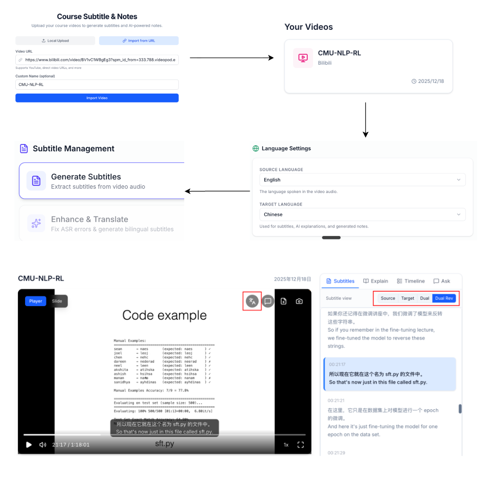

# 双语字幕

### Demo Flow

- 支持本地上传视频或通过 URL 一键导入
- 选择源语言和目标语言
- 一键生成字幕，后台自动处理，完成后通知你
- 利用 LLM 智能提升字幕质量并自动翻译成目标语言
- 开始观看体验
  - 可在播放器区域或字幕区域灵活设置字幕的显示方式
  - 支持一键在原文/译文之间切换（按钮/快捷键 `T`）
  - 离开页面可自动切换为译文，返回后恢复原模式
  - 字幕区域自动同步追踪视频进度，并支持点击任意字幕片段实时跳转到对应时间点
  - DeepLecture 会自动记录你的观看进度，下次打开可无缝续播

## Zoom VS DeepLecture

|  | Zoom | DeepLecture |
|--|------|-------------|
| **ASR 精度** | 闭源 ASR | Whisper large-v3-turbo |
| **ASR 后处理** | $\times$ | $\checkmark$ 去冗余、修错、润色 |
| **字幕结构** | 原始碎片输出，无双语字幕 | LLM 智能合并为完整句子，双语字幕 |
| **翻译方式** | 逐句机翻 | 上下文感知（理解主题/术语/语气） |

