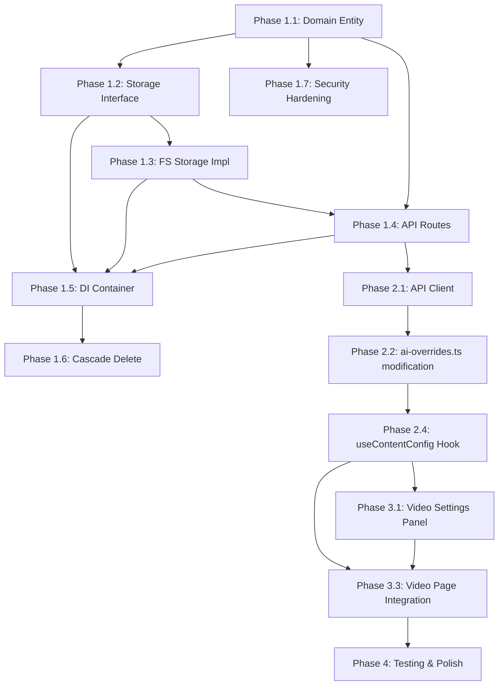
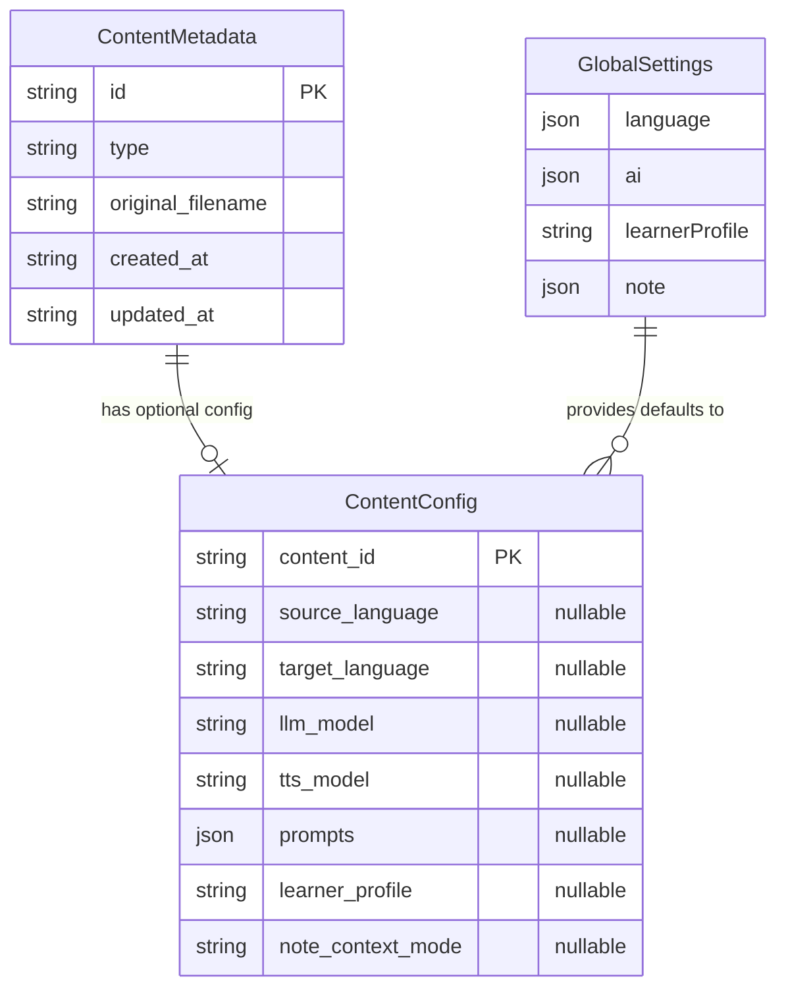

## Enhancement Summary

**Deepened on:** 2026-02-10
**Sections enhanced:** All major sections
**Agents used:** Python Code Quality, TypeScript Code Quality, Performance, Security, Simplicity, Pattern Consistency, Best Practices Research, Framework Docs Research, Clean Architecture

### Key Improvements from Deepening

1. **~65% LOC reduction**: Simplicity review identified that L3 (per-task invocation overrides) and the pre-task config popover are YAGNI. Cut to a 2-level cascade.
2. **7 files instead of ~33**: By modifying `getAIOverrides()` with a module-level `currentVideoConfig` reference, we avoid threading `resolvedConfig` through 12+ API functions and handlers.
3. **Critical framework fix**: Original plan referenced FastAPI; codebase uses Flask Blueprints. All route code corrected.
4. **Sync, not async**: All storage protocols in the codebase are synchronous. Protocol corrected from `async def get()` to `def load()`.
5. **PUT instead of PATCH**: Eliminates backend merge logic, per-field DELETE endpoint, and phantom multi-tab safety concerns. The frontend always has the full sparse object.

### Critical Fixes Applied

| Original Issue | Source | Fix |
|---|---|---|
| Protocol uses `async` methods | Python Reviewer | Changed to sync, renamed `get` → `load` |
| Plan references FastAPI | Python Reviewer, Pattern Reviewer | Rewritten as Flask Blueprint |
| `frozen=True, slots=True` combo | Pattern Reviewer | Use `frozen=True` only (value object) |
| `note_context_mode: str` | Python Reviewer | Changed to `Literal["subtitle", "slide", "both"]` |
| 12+ API function refactor | Simplicity Reviewer | Module-level `currentVideoConfig` approach |
| L3 Per-Task Overrides | Simplicity Reviewer | Cut entirely (YAGNI) |
| `resolveConfigSources()` | Simplicity Reviewer | Sparse object IS the source indicator |
| Optimistic updates with rollback | Performance + Simplicity | Simple `await save(); refetch()` |
| No JSON payload size limit | Security Reviewer | Set global `MAX_CONTENT_LENGTH` |
| CORS wildcard origin | Security Reviewer | Wire `server.cors_allow_origins` from settings |

---

# ✨ feat: Cascading Task Configuration (Global → Per-Video)

## Overview

Implement a **2-level cascading configuration system** that allows task parameters (language, LLM model, TTS model, prompts, etc.) to be configured at two levels of specificity:

1. **Global defaults** — User preferences that apply to all videos (existing `useGlobalSettingsStore`)
2. **Per-video overrides** — Settings specific to a video, stored on the backend (new)

Each level stores only **explicit overrides** (sparse objects). Resolution merges both levels using field-level deep merge, with per-video overrides winning. This is the same pattern used by VS Code settings (User → Workspace).

> **Design decision (from Simplicity Review):** The original brainstorm proposed 3 levels (Global → Per-Video → Per-Task). L3 (per-task invocation) was cut because: (a) a user who wants a one-time different setting can change the per-video config, run the task, then change it back; (b) removing L3 eliminates an entire UI component (TaskConfigPopover), the TASK_CONFIG_FIELDS mapping, L3 merge logic, and L3 state management in every Generate button component. If actual user need emerges, L3 can be added later without architectural changes.

## Problem Statement

All content-related parameters (language pair, LLM model, TTS model, prompts, note context mode) currently live exclusively in the global settings store. When users work with videos in different languages or want different AI models for different content, they must manually switch global settings before each task — tedious, error-prone, and fundamentally broken for multi-video workflows.

**Example pain point**: A user studying both Chinese math lectures and English CS courses must toggle `language.translated` between `"zh"` and `"en"` every time they switch videos. Their prompt preferences, model choices, and context modes also differ between subjects.

## Proposed Solution

### Architecture: Cascading Override Resolution

```
┌──────────────────────────────────────────────────────────────┐
│                   Config Resolution Flow                      │
│                                                               │
│   L1: Global Defaults        L2: Per-Video Overrides          │
│   (localStorage)             (backend JSON)                   │
│   ┌─────────────┐           ┌─────────────────┐              │
│   │ language:    │           │ source_language: │              │
│   │   original:"en"│  merge  │   "ja"          │              │
│   │   translated:"zh"│ ───→  │ llm_model:      │              │
│   │ ai:          │           │   "claude"      │              │
│   │   llmModel:"gpt-4o"│    │                  │              │
│   │   ttsModel:null│         │                  │              │
│   │   prompts:{...}│         │                  │              │
│   └─────────────┘           └─────────────────┘              │
│           │                         │                         │
│           └─────────┬───────────────┘                         │
│                     ▼                                         │
│             Effective Config                                  │
│           ┌──────────────────┐                                │
│           │ source_language:  │                                │
│           │   "ja"           │  ← from per-video override     │
│           │ target_language:  │                                │
│           │   "zh"           │  ← inherited from global       │
│           │ llm_model:       │                                │
│           │   "claude"       │  ← from per-video override     │
│           │ tts_model:       │                                │
│           │   null           │  ← inherited from global       │
│           │ prompts:         │                                │
│           │   {...merged}    │  ← key-level merge             │
│           └──────────────────┘                                │
│                     │                                         │
│                     ▼                                         │
│             Sent in API request body                          │
│             via withLLMOverrides() / withAIOverrides()        │
└──────────────────────────────────────────────────────────────┘
```

**Key design decisions:**
- **Sparse storage**: Per-video level stores only fields that differ from global. Absent key = inherit.
- **Field-level deep merge**: For `prompts` (Record<string, string>), merge at the key level. For primitive fields, per-video wins.
- **Frontend resolves**: The frontend merges L1+L2 via the existing `getAIOverrides()` chokepoint in `ai-overrides.ts` and sends the final resolved config in the API request body.
- **Backend persists L2**: Per-video config is a JSON file stored alongside content data, following the existing `fs_*_storage` pattern.
- **Module-level current config**: Instead of threading `resolvedConfig` through 12+ API functions, a module-level reference in `ai-overrides.ts` holds the current video's config. Set on video page mount, cleared on unmount. All existing `withLLMOverrides()` / `withTTSOverrides()` calls automatically pick up per-video config with zero changes.

---

## Technical Approach

### Per-Video Config Schema

Only task-relevant settings are overridable per-video. UI preferences (font size, notifications, layout) remain global-only.

```typescript
// frontend/stores/types.ts — NEW TYPES

/** The canonical shape of all task-configurable fields */
interface TaskConfigShape {
    sourceLanguage: string;
    targetLanguage: string;
    llmModel: string | null;   // null = use backend default
    ttsModel: string | null;   // null = use backend default
    prompts: Record<string, string>; // {funcId: implId}
    learnerProfile: string;
    noteContextMode: "subtitle" | "slide" | "both";
}

/** Per-video overrides: only set what differs from global (Partial<>) */
type PerVideoConfig = Partial<TaskConfigShape>;

/** Resolved config after merge: guaranteed fully populated */
type ResolvedTaskConfig = Readonly<TaskConfigShape>;
```

> **Research Insight (TS Reviewer):** Derive both `PerVideoConfig` and `ResolvedTaskConfig` from a single `TaskConfigShape` base type. This is mechanically impossible to diverge — if `TaskConfigShape` changes, both derived types update automatically. Do NOT use explicit `| null` on optional fields — that creates a three-state problem (`undefined` vs `null` vs value). Absent key = not overridden. Present key = overridden. This is unambiguous and matches how `AIOverrides` already works in `ai-overrides.ts`.

```python
# src/deeplecture/domain/entities/config.py — NEW DATACLASS

from __future__ import annotations

from dataclasses import dataclass, fields
from typing import Any, Literal

NoteContextMode = Literal["subtitle", "slide", "both"]


@dataclass(frozen=True)
class ContentConfig:
    """Sparse per-video configuration overrides.

    This is a value object: created, merged, and replaced but never mutated.
    None fields mean 'inherit from global/default'.
    """

    source_language: str | None = None
    target_language: str | None = None
    llm_model: str | None = None
    tts_model: str | None = None
    prompts: dict[str, str] | None = None  # {func_id: impl_id}
    learner_profile: str | None = None
    note_context_mode: NoteContextMode | None = None

    def to_sparse_dict(self) -> dict[str, Any]:
        """Return only non-None fields for JSON serialization."""
        return {
            f.name: getattr(self, f.name)
            for f in fields(self)
            if getattr(self, f.name) is not None
        }

    @classmethod
    def from_dict(cls, data: dict[str, Any]) -> ContentConfig:
        """Create from sparse dict, ignoring unknown keys."""
        known = {f.name for f in fields(cls)}
        return cls(**{k: v for k, v in data.items() if k in known})
```

> **Research Insight (Python Reviewer):**
> - Use `frozen=True` without `slots=True` — no existing entity combines both. `frozen=True` alone is the correct choice for a value object.
> - Import `fields` from `dataclasses` (missing in original plan).
> - Use `from __future__ import annotations` (every existing entity file uses this).
> - Use `Literal["subtitle", "slide", "both"]` for `note_context_mode` instead of bare `str`.
> - The `merge_with()` method from the original plan is dropped — with PUT semantics, the frontend always sends the full sparse object. No server-side merge needed.

### Inheritance Semantics

| JSON state | Meaning | Resolution behavior |
|---|---|---|
| Key absent from object | "Not set — inherit from global" | Skip, use global value |
| Key present with a value | "Explicit override" | Use this value |
| Key present with `null` | "Explicitly use backend default" (for model fields) | Use `null` (= backend default) |

> **Research Insight (Python Reviewer):** `prompts={}` (empty dict) and `prompts=None` are semantically equivalent — both mean "inherit all prompts from global." This is correct behavior but should be documented because a user might interpret `{}` as "clear all prompt overrides." To remove all prompt overrides, simply omit the `prompts` key from the PUT body.

### Storage Format

Per-video config is stored as a JSON sidecar file following the existing `fs_*_storage` pattern:

```
data/content/{content_id}/config.json
```

Example content:
```json
{
  "source_language": "ja",
  "target_language": "zh",
  "llm_model": "claude-3-5-sonnet",
  "prompts": {
    "timeline_segmentation": "concise_v2"
  }
}
```

Only non-null overrides are persisted. Empty object `{}` means "inherit everything from global."

---

## Implementation Phases

### Phase 1: Backend — Storage, Entity, API

Create the backend infrastructure for per-video config CRUD.

#### 1.1 Domain Entity

**New file: `src/deeplecture/domain/entities/config.py`**

See schema above. Register in `src/deeplecture/domain/entities/__init__.py` and add to `__all__`.

#### 1.2 Storage Interface

**New file: `src/deeplecture/use_cases/interfaces/config.py`**

```python
from __future__ import annotations

from typing import TYPE_CHECKING, Protocol

if TYPE_CHECKING:
    from deeplecture.domain.entities.config import ContentConfig


class ContentConfigStorageProtocol(Protocol):
    """Contract for per-video configuration persistence."""

    def load(self, content_id: str) -> ContentConfig | None:
        """Load per-video config. Returns None if not configured."""
        ...

    def save(self, content_id: str, config: ContentConfig) -> None:
        """Save per-video config (full replacement)."""
        ...

    def delete(self, content_id: str) -> None:
        """Delete per-video config."""
        ...
```

> **Research Insight (Pattern Reviewer + Python Reviewer):**
> - ALL existing protocols are synchronous — no `async`. This is critical.
> - Use `load` not `get` — the established name for file-based retrieval (`NoteStorageProtocol.load`, `CheatsheetStorageProtocol.load`, etc.).
> - Use `TYPE_CHECKING` guard for domain imports (pattern from every existing protocol).
> - `@runtime_checkable` is optional — only 3 of 10+ existing protocols use it.

Register in `src/deeplecture/use_cases/interfaces/__init__.py` and add to `__all__`.

#### 1.3 Filesystem Storage Implementation

**New file: `src/deeplecture/infrastructure/repositories/fs_content_config_storage.py`**

Following the `FsCheatsheetStorage` / `FsNoteStorage` pattern:
- Constructor: `def __init__(self, path_resolver: PathResolverProtocol) -> None:` with `self._paths = path_resolver`
- Class constants: `NAMESPACE = "config"`, `FILENAME = "config.json"`
- Path construction via `self._paths.build_content_path(content_id, self.NAMESPACE, self.FILENAME)`
- `validate_segment(content_id, "content_id")` at the start of every public method
- Atomic writes: `tempfile.NamedTemporaryFile` + `os.fsync` + `os.replace` in `try/finally`
- Error handling: `except OSError as exc: logger.warning(...)`, return `None` on read failure
- Module-level `logger = logging.getLogger(__name__)` and `UTC = timezone.utc`

> **Research Insight (Performance Reviewer):** No in-memory cache needed. Config files are <1KB; local SSD read with OS page cache takes ~0.02ms. All 11 existing `fs_*_storage` files have zero caching. Follow the established pattern.

#### 1.4 API Routes

**New file: `src/deeplecture/presentation/api/routes/content_config.py`**

Uses **Flask Blueprint** (NOT FastAPI):

| Endpoint | Method | Purpose |
|---|---|---|
| `GET /content/{id}/config` | GET | Return sparse per-video config (only overrides) |
| `PUT /content/{id}/config` | PUT | Replace sparse per-video config (full replacement) |
| `DELETE /content/{id}/config` | DELETE | Remove all per-video overrides |

```python
from __future__ import annotations

from typing import TYPE_CHECKING

from flask import Blueprint, request

from deeplecture.di import get_container
from deeplecture.domain.entities.config import ContentConfig
from deeplecture.presentation.api.shared import handle_errors, success
from deeplecture.presentation.api.shared.validation import validate_content_id

if TYPE_CHECKING:
    from flask import Response

bp = Blueprint("content_config", __name__)


@bp.route("/<content_id>/config", methods=["GET"])
@handle_errors
def get_config(content_id: str) -> Response:
    content_id = validate_content_id(content_id)
    container = get_container()
    config = container.content_config_storage.load(content_id)
    if config is None:
        return success({})
    return success(config.to_sparse_dict())


@bp.route("/<content_id>/config", methods=["PUT"])
@handle_errors
def put_config(content_id: str) -> Response:
    content_id = validate_content_id(content_id)
    data = request.get_json(silent=True) or {}
    _validate_config_fields(data)
    config = ContentConfig.from_dict(data)
    container = get_container()
    container.content_config_storage.save(content_id, config)
    return success(config.to_sparse_dict())


@bp.route("/<content_id>/config", methods=["DELETE"])
@handle_errors
def delete_config(content_id: str) -> Response:
    content_id = validate_content_id(content_id)
    container = get_container()
    container.content_config_storage.delete(content_id)
    return success({})
```

> **Research Insight (Simplicity Reviewer):** PUT instead of PATCH eliminates:
> - Backend merge logic (the frontend always has the full sparse object)
> - Per-field DELETE endpoint (`DELETE /content/{id}/config/{field}`)
> - Multi-tab conflict concerns (phantom problem for a single-user local app)
> Result: 3 endpoints instead of 4, simpler backend code.

> **Research Insight (Security Reviewer):** Validation in the route handler:
> - Validate `llm_model` against `container.llm_provider.list_models()` whitelist
> - Validate `tts_model` against `container.tts_provider.list_models()` whitelist
> - Validate `prompts` `{func_id: impl_id}` pairs against `container.prompt_registry`
> - Sanitize `learner_profile` at write time using `sanitize_learner_profile()` from `prompt_safety.py`
> - Validate `note_context_mode` is one of `"subtitle"`, `"slide"`, `"both"`
> - Enforce per-field length limits (learner_profile: max 2000 chars, model names: max 128 chars)
> - Return generic 400 errors (don't leak valid model/prompt lists)

#### 1.5 DI Container Registration

**Modified file: `src/deeplecture/di/container.py`**

Add cached property following existing pattern:

```python
@property
def content_config_storage(self) -> FsContentConfigStorage:
    if "content_config_storage" not in self._cache:
        self._cache["content_config_storage"] = FsContentConfigStorage(self.path_resolver)
    return self._cache["content_config_storage"]
```

Register blueprint in `_register_blueprints()` in `app.py`:
```python
from deeplecture.presentation.api.routes.content_config import bp as content_config_bp
app.register_blueprint(content_config_bp, url_prefix="/api/content")
```

#### 1.6 Cascade Delete

**Modified file: `src/deeplecture/use_cases/content.py`**

Add `config_storage: ContentConfigStorageProtocol` as a new dependency to `ContentUseCase.__init__()`. Add best-effort cleanup in `delete_content()`:

```python
# BEST-EFFORT: Clean up per-video config (matching artifact cleanup pattern)
try:
    self._config.delete(content_id)
except Exception:
    logger.exception(
        "Config cleanup failed for content %s (metadata already deleted)",
        content_id,
    )
```

> **Research Insight (Python Reviewer):** Follow the existing artifact cleanup pattern — best-effort with `try/except`, log failures, don't block primary metadata deletion.

#### 1.7 Security Hardening (Pre-requisite)

**Modified file: `src/deeplecture/presentation/api/app.py`**

Before implementing config endpoints, apply these security improvements:

```python
# Set global payload size limit (prevents memory exhaustion via large JSON)
app.config["MAX_CONTENT_LENGTH"] = 1 * 1024 * 1024  # 1MB for API endpoints

# Wire CORS origins from settings instead of wildcard
from deeplecture.config.settings import Settings
settings = Settings()
CORS(
    app,
    resources={
        r"/*": {
            "origins": settings.server.cors_allow_origins or "*",
            ...
        }
    },
)
```

> **Research Insight (Security Reviewer):** The `server.cors_allow_origins` setting already exists in `settings.py` but is not wired into `create_app()`. Fixing this costs one line and closes a MEDIUM-severity CORS issue.

---

### Phase 2: Frontend — Config Resolution & AI Override Integration

Build the frontend infrastructure for fetching and resolving per-video config via the existing `ai-overrides.ts` chokepoint.

#### 2.1 API Client

**New file: `frontend/lib/api/contentConfig.ts`**

```typescript
import { api } from "./client";
import type { PerVideoConfig } from "@/stores/types";

export const getContentConfig = async (contentId: string): Promise<PerVideoConfig> => {
    const response = await api.get<PerVideoConfig>(`/content/${contentId}/config`);
    return response.data;
};

export const putContentConfig = async (
    contentId: string,
    config: PerVideoConfig
): Promise<PerVideoConfig> => {
    const response = await api.put<PerVideoConfig>(`/content/${contentId}/config`, config);
    return response.data;
};

export const deleteContentConfig = async (contentId: string): Promise<void> => {
    await api.delete(`/content/${contentId}/config`);
};
```

Re-export from `frontend/lib/api/index.ts`. Add `PerVideoConfig` response type to `frontend/lib/api/types.ts`.

#### 2.2 Module-Level Current Video Config (The Key Architectural Change)

**Modified file: `frontend/lib/api/ai-overrides.ts`**

This is the **single most important change** in the entire feature. Instead of threading `resolvedConfig` through 12+ API functions and 12+ handlers, we modify the existing chokepoint:

```typescript
// ai-overrides.ts — the ONLY API file that needs changing

import type { PerVideoConfig } from "@/stores/types";

/** Module-level reference to the current video's per-video config.
 *  Set by VideoPageClient on mount, cleared on unmount.
 *  All withLLMOverrides/withTTSOverrides calls automatically merge this. */
let currentVideoConfig: PerVideoConfig | null = null;

export function setCurrentVideoConfig(config: PerVideoConfig | null): void {
    currentVideoConfig = config;
}

export function getAIOverrides(): AIOverrides {
    const { ai, language } = useGlobalSettingsStore.getState();

    // Per-video overrides take precedence over global defaults
    const effectiveLlmModel = currentVideoConfig?.llmModel ?? ai.llmModel;
    const effectiveTtsModel = currentVideoConfig?.ttsModel ?? ai.ttsModel;
    const effectivePrompts = {
        ...ai.prompts,
        ...(currentVideoConfig?.prompts ?? {}),
    };

    return stripEmpty({
        llm_model: effectiveLlmModel,
        tts_model: effectiveTtsModel,
        prompts: Object.keys(effectivePrompts).length > 0
            ? effectivePrompts
            : undefined,
    });
}

// Similarly for language overrides used by API functions
export function getLanguageOverrides(): { source_language?: string; target_language?: string } {
    const { language } = useGlobalSettingsStore.getState();
    return {
        source_language: currentVideoConfig?.sourceLanguage ?? language.original,
        target_language: currentVideoConfig?.targetLanguage ?? language.translated,
    };
}
```

**Result:** Zero changes to `withLLMOverrides()`, `withTTSOverrides()`, `withAIOverrides()`. Zero changes to any API function in `timeline.ts`, `quiz.ts`, `notes.ts`, `cheatsheet.ts`, etc. Zero changes to any handler hook. The existing calls automatically pick up per-video config.

> **Research Insight (TS Reviewer + Simplicity Reviewer):** This is the highest-impact simplification. The original plan proposed adding a `resolvedConfig` parameter to 12+ API functions and 12+ handlers across ~20 files. The module-level approach achieves the same result by modifying **1 file** (`ai-overrides.ts`). The existing `withLLMOverrides()` calls already funnel through `getAIOverrides()` — that's the only function that reads from the Zustand store. Modifying this single chokepoint is all that's needed.

#### 2.3 Config Resolution Utility

**Inline in `useContentConfig` hook** (not a separate file — with only 2 levels, the merge is ~10 lines):

```typescript
function resolveConfig(
    global: GlobalSettings,
    perVideo: PerVideoConfig | null
): ResolvedTaskConfig {
    const p = perVideo ?? {};
    return {
        sourceLanguage: p.sourceLanguage ?? global.language.original,
        targetLanguage: p.targetLanguage ?? global.language.translated,
        llmModel: p.llmModel ?? global.ai.llmModel,
        ttsModel: p.ttsModel ?? global.ai.ttsModel,
        prompts: { ...global.ai.prompts, ...(p.prompts ?? {}) },
        learnerProfile: p.learnerProfile ?? global.learnerProfile,
        noteContextMode: p.noteContextMode ?? global.note.contextMode,
    };
}
```

> **Research Insight (TS Reviewer):** Use simple spread, not a deep merge library. The prompts merge is the only nested case, and explicit spread handles it in one line. Add a `stripUndefined` utility to prevent `undefined` values from clobbering defined ones during spread — TypeScript won't catch this at compile time.

> **Research Insight (Performance Reviewer):** Memoize the resolved config with `useMemo` keyed on the source objects. The merge itself is ~0.001ms (negligible CPU), but referential stability matters for React reconciliation to prevent unnecessary re-renders downstream.

#### 2.4 Content Config Hook

**New file: `frontend/hooks/useContentConfig.ts`**

```typescript
"use client";

import { useCallback, useEffect, useMemo, useState } from "react";
import { logger } from "@/shared/infrastructure";
import { getContentConfig, putContentConfig, deleteContentConfig } from "@/lib/api/contentConfig";
import { setCurrentVideoConfig } from "@/lib/api/ai-overrides";
import { useGlobalSettingsStore } from "@/stores/useGlobalSettingsStore";
import type { PerVideoConfig, ResolvedTaskConfig } from "@/stores/types";

const log = logger.scope("useContentConfig");

interface UseContentConfigParams {
    contentId: string;
}

interface UseContentConfigReturn {
    /** Sparse per-video overrides (only fields explicitly set) */
    overrides: PerVideoConfig;
    /** Fully resolved config (global + per-video merged) */
    resolved: ResolvedTaskConfig;
    /** Whether the initial fetch is in progress */
    loading: boolean;
    /** Update one or more per-video override fields */
    setOverrides: (updates: PerVideoConfig) => Promise<void>;
    /** Remove a specific override field (reset to global) */
    clearOverride: (field: keyof PerVideoConfig) => Promise<void>;
    /** Remove all per-video overrides */
    clearAllOverrides: () => Promise<void>;
    /** Whether a field is explicitly overridden per-video */
    isOverridden: (field: keyof PerVideoConfig) => boolean;
}

export function useContentConfig({ contentId }: UseContentConfigParams): UseContentConfigReturn {
    const [overrides, setOverridesState] = useState<PerVideoConfig>({});
    const [loading, setLoading] = useState(true);

    // Fetch per-video config on mount
    useEffect(() => {
        let cancelled = false;

        const fetchConfig = async () => {
            try {
                const config = await getContentConfig(contentId);
                if (!cancelled) {
                    setOverridesState(config);
                    setCurrentVideoConfig(config);
                }
            } catch (error) {
                log.error("Failed to fetch video config", error, { contentId });
                if (!cancelled) {
                    setOverridesState({});
                    setCurrentVideoConfig(null);
                }
            } finally {
                if (!cancelled) setLoading(false);
            }
        };

        fetchConfig();
        return () => {
            cancelled = true;
            setCurrentVideoConfig(null); // Clear on unmount
        };
    }, [contentId]);

    // Resolve config: merge global + per-video
    const globalSettings = useGlobalSettingsStore();
    const resolved = useMemo<ResolvedTaskConfig>(
        () => resolveConfig(globalSettings, overrides),
        [globalSettings, overrides]
    );

    // Keep module-level reference in sync
    useEffect(() => {
        setCurrentVideoConfig(overrides);
    }, [overrides]);

    const setOverrides = useCallback(async (updates: PerVideoConfig) => {
        const newOverrides = { ...overrides, ...updates };
        setOverridesState(newOverrides);
        setCurrentVideoConfig(newOverrides);
        try {
            await putContentConfig(contentId, newOverrides);
        } catch (error) {
            log.error("Failed to save video config", error, { contentId });
            // Revert on failure
            setOverridesState(overrides);
            setCurrentVideoConfig(overrides);
        }
    }, [contentId, overrides]);

    const clearOverride = useCallback(async (field: keyof PerVideoConfig) => {
        const newOverrides = { ...overrides };
        delete newOverrides[field];
        setOverridesState(newOverrides);
        setCurrentVideoConfig(newOverrides);
        try {
            await putContentConfig(contentId, newOverrides);
        } catch (error) {
            log.error("Failed to clear override", error, { contentId, field });
            setOverridesState(overrides);
            setCurrentVideoConfig(overrides);
        }
    }, [contentId, overrides]);

    const clearAllOverrides = useCallback(async () => {
        setOverridesState({});
        setCurrentVideoConfig(null);
        try {
            await deleteContentConfig(contentId);
        } catch (error) {
            log.error("Failed to clear all overrides", error, { contentId });
            setOverridesState(overrides);
            setCurrentVideoConfig(overrides);
        }
    }, [contentId, overrides]);

    const isOverridden = useCallback(
        (field: keyof PerVideoConfig) => field in overrides && overrides[field] !== undefined,
        [overrides]
    );

    return { overrides, resolved, loading, setOverrides, clearOverride, clearAllOverrides, isOverridden };
}
```

> **Research Insight (Performance Reviewer):** Bundle the config fetch with the existing metadata response if possible (zero additional requests). Otherwise, fetch in parallel in `data.ts` server component. Do NOT lazy-load on settings panel open — the config affects task submission behavior.

> **Research Insight (Performance Reviewer):** For the `setOverrides` mutation, debounce the PUT with an 800ms accumulation window. This prevents network spam if the user rapidly changes multiple fields (slider drags, toggle-and-untoggle). Flush pending changes on page unmount.

#### 2.5 Fix Pre-Existing Deletion Bug

**Modified file: `frontend/components/video/VideoList.tsx`**

Add `useVideoStateStore.getState().clearVideoState(contentId)` to `handleDelete()`.

---

### Phase 3: Frontend — UI Components

Build the Video Settings Panel UI.

#### 3.1 Video Settings Panel

**New file: `frontend/components/dialogs/VideoConfigPanel.tsx`**

A dialog accessible from the video page (gear icon in the header area). Uses the same `SettingsSection`, `SettingsCard`, `SettingsRow` primitives from the existing Settings dialog.

**Layout:**

```
┌──────────────────────────────────────────┐
│ Video Configuration              [Reset All] │
│ Settings for: "Linear Algebra Lecture 3"     │
├──────────────────────────────────────────┤
│                                              │
│ ── Language ──────────────────────────────── │
│ Source Language    [English ▾]                │
│ Target Language   [Japanese ▾]    [↩ reset]  │
│                                              │
│ ── AI Models ─────────────────────────────── │
│ LLM Model         [Claude 3.5 ▾] [↩ reset]  │
│ TTS Model         [Default ▾]                │
│                                              │
│ ── Content ───────────────────────────────── │
│ Learner Profile   [Edit...]                  │
│ Note Context      [Both ▾]                   │
│                                              │
│ ── Prompts ───────────────────────────────── │
│ Timeline          [Default ▾]                │
│ Quiz              [Concise v2 ▾]  [↩ reset]  │
│ Note              [Default ▾]                │
│ ... (other prompt functions)                 │
└──────────────────────────────────────────┘
```

**Override indicators (simplified from original plan):**
- Fields with per-video overrides show a `[↩ reset]` button
- Fields inherited from global show no button
- The **presence of the reset button IS the indicator** — no colored badges, no `resolveConfigSources()` function needed

> **Research Insight (Simplicity Reviewer):** The sparse `perVideoConfig` object itself is the source indicator. `isOverridden(field)` checks `field in perVideoConfig`. No separate `resolveConfigSources()` function, no separate data structure.

**Behavior:**
- Reads per-video config from `useContentConfig(contentId)`
- Dropdowns show all available options (from `/config` endpoint)
- Changing a value calls `setOverrides()` with debounced PUT
- `[↩ reset]` button calls `clearOverride(field)`
- "Reset All" button calls `clearAllOverrides()` with confirmation dialog
- Loading state: skeleton placeholders while fetching backend config

#### 3.2 Global Settings Dialog Updates

**Modified file: `frontend/components/dialogs/settings/GeneralTab.tsx`**
**Modified file: `frontend/components/dialogs/settings/ModelTab.tsx`**

For the settings that are now overridable per-video, add a subtle label:

```
Language Settings (defaults for new videos)
┌──────────────────────────────────────┐
│ These are your default preferences.  │
│ Individual videos can override them  │
│ via the video settings panel.        │
└──────────────────────────────────────┘
```

No behavioral change — these tabs continue to write to `useGlobalSettingsStore`. The label is purely informational.

#### 3.3 Video Page Integration

**Modified file: `frontend/app/video/[id]/VideoPageClient.tsx`**

- Call `useContentConfig({ contentId: videoId })` at the top level
- The hook automatically sets `currentVideoConfig` in `ai-overrides.ts` (no prop drilling needed)
- Add a gear icon button that opens `VideoConfigPanel`

---

### Phase 4: Testing & Polish

#### 4.1 Backend Tests

**New file: `tests/unit/domain/test_content_config.py`**

- `ContentConfig.to_sparse_dict()` — excludes None fields
- `ContentConfig.from_dict()` — ignores unknown keys
- `ContentConfig.from_dict()` — handles empty dict (returns all-None config)
- `prompts={}` is treated as "no overrides" (same as `prompts=None`)

**New file: `tests/unit/infrastructure/test_fs_content_config_storage.py`**

- Save and load round-trip
- Load non-existent config returns None
- Delete removes the file
- Atomic write safety (crash during write doesn't corrupt existing file)

**New file: `tests/unit/presentation/test_content_config_routes.py`**

- GET returns sparse config
- PUT replaces entire config (not merge)
- PUT validates model/language/prompt references
- DELETE removes config
- GET after content deletion returns empty `{}`

#### 4.2 Frontend Tests

**New file: `frontend/lib/__tests__/configResolution.test.ts`**

- `resolveConfig()` — all levels empty returns global defaults
- L2 overrides L1 for set fields, inherits for absent fields
- Prompts merge at key level (not replace)
- `null` llmModel at L2 means "use backend default", not "inherit from L1"

---

## Alternative Approaches Considered

| Approach | Why Rejected |
|---|---|
| **3-Level Cascade (L3 Per-Task)** | YAGNI — per-video config is sufficient; L3 adds popover UI, merge logic, and state management for a rare use case. Can be added later. |
| **Full Config Snapshots** (copy global to per-video on create) | Global default changes don't propagate; storage duplication; "reset to default" is ambiguous |
| **Template-Based Config** (named presets) | Adds UX complexity (another concept to learn); overkill for most users; can be added later on top of cascading overrides |
| **Backend Resolution** (send L1 with every request, let backend merge) | Contradicts existing frontend-resolution pattern; backend would need to know about localStorage structure |
| **Frontend-Only Per-Video Storage** (localStorage) | Not durable; lost on browser clear; doesn't survive device switches |
| **PATCH with field-level merge** | Adds merge logic on backend, per-field DELETE endpoint, multi-tab safety code — all unnecessary for single-user local app with PUT semantics |
| **Thread resolvedConfig through 12+ API functions** | Massive refactor across ~20 files. Module-level `currentVideoConfig` in `ai-overrides.ts` achieves the same result by modifying 1 file |
| **SWR / React Query for config** | Project uses Zustand + manual fetch everywhere. Introducing SWR for one feature creates competing paradigms |

---

## Acceptance Criteria

### Functional Requirements

- [ ] Per-video configuration can be created, read, replaced (PUT), and deleted via REST API
- [ ] Config resolution correctly merges 2 levels with field-level deep merge
- [ ] Prompts merge at the `{funcId: implId}` key level, not replace
- [ ] `null` model values mean "use backend default" (distinct from absent = inherit)
- [ ] Video Settings Panel shows effective values with reset buttons on overridden fields
- [ ] Video Settings Panel allows setting and resetting individual overrides
- [ ] "Reset All" clears all per-video overrides with confirmation
- [ ] All 10 AI-related task types use the resolved config from the 2-level cascade
- [ ] Deleting a video also deletes its per-video config (cascade delete)
- [ ] Frontend video state cleanup on deletion (`clearVideoState` bug fix)
- [ ] Global Settings dialog labels content-related settings as "defaults for new videos"

### Non-Functional Requirements

- [ ] Per-video config fetch adds < 50ms to video page load (bundled with metadata or parallel fetch)
- [ ] Config writes debounced with 800ms window to prevent network spam
- [ ] Pending config writes flushed on page unmount (prevent data loss)
- [ ] No breaking changes — videos without per-video config inherit everything from global (backward compatible)
- [ ] No migration needed — absent config file = inherit all (the cascade handles it naturally)
- [ ] `learner_profile` sanitized at write time via `sanitize_learner_profile()`
- [ ] Global `MAX_CONTENT_LENGTH` set in Flask app (prevent memory exhaustion)
- [ ] CORS origins wired from `server.cors_allow_origins` setting

### Quality Gates

- [ ] Unit tests for `ContentConfig` entity (serialization, edge cases)
- [ ] Unit tests for `resolveConfig()` function (all level combinations)
- [ ] Unit tests for config storage (save, load, delete)
- [ ] Integration tests for config API routes (CRUD + validation)

---

## Dependency Analysis



---

## Risk Analysis & Mitigation

| Risk | Likelihood | Impact | Mitigation |
|---|---|---|---|
| Module-level `currentVideoConfig` becomes stale | Low | Medium | Cleared on unmount; updated via `useEffect` on overrides change; only one video page can be active at a time |
| PUT replaces config — user loses overrides if two tabs save simultaneously | Low | Low | Single-user local app; last-write-wins is acceptable. If needed later, add ETag-based optimistic concurrency. |
| `learner_profile` prompt injection | Medium | Medium | Sanitize at write time with existing `sanitize_learner_profile()` from `prompt_safety.py` |
| Per-video config fetch slows video page load | Low | Low | Single small JSON file (< 1KB); bundle with metadata or parallel fetch |
| Migration complexity for existing users | Low | Low | No migration needed — absent config file = inherit all |

---

## ERD: New Data Relationships



---

## File Change Summary

### New Files (7)

| File | Purpose |
|---|---|
| `src/deeplecture/domain/entities/config.py` | `ContentConfig` domain entity (frozen value object) |
| `src/deeplecture/use_cases/interfaces/config.py` | `ContentConfigStorageProtocol` (sync, `load`/`save`/`delete`) |
| `src/deeplecture/infrastructure/repositories/fs_content_config_storage.py` | Filesystem storage with atomic writes |
| `src/deeplecture/presentation/api/routes/content_config.py` | Flask Blueprint: GET/PUT/DELETE `/content/{id}/config` |
| `frontend/lib/api/contentConfig.ts` | API client functions |
| `frontend/hooks/useContentConfig.ts` | Config fetch, cache, resolve hook + `setCurrentVideoConfig` |
| `frontend/components/dialogs/VideoConfigPanel.tsx` | Per-video settings dialog |

### New Test Files (3)

| File | Purpose |
|---|---|
| `tests/unit/domain/test_content_config.py` | Entity tests |
| `tests/unit/infrastructure/test_fs_content_config_storage.py` | Storage tests |
| `tests/unit/presentation/test_content_config_routes.py` | API route tests |

### Modified Files (~5)

| File | Change |
|---|---|
| `src/deeplecture/di/container.py` | Register new storage + inject into routes and content use case |
| `src/deeplecture/use_cases/content.py` | Add cascade delete for config |
| `src/deeplecture/presentation/api/app.py` | Register new blueprint + security hardening (MAX_CONTENT_LENGTH, CORS) |
| `frontend/lib/api/ai-overrides.ts` | Add `setCurrentVideoConfig()`, merge per-video config into existing override functions |
| `frontend/app/video/[id]/VideoPageClient.tsx` | Call `useContentConfig`, add gear icon for VideoConfigPanel |

### Optional Modified Files (~3)

| File | Change |
|---|---|
| `frontend/components/video/VideoList.tsx` | Fix deletion cleanup bug |
| `frontend/components/dialogs/settings/GeneralTab.tsx` | Add "defaults for new videos" label |
| `frontend/components/dialogs/settings/ModelTab.tsx` | Add "defaults for new videos" label |

**Total: ~15 files (7 new + 3 test + ~5 modified) instead of the original ~33 files**

---

## Future Considerations

- **L3 Per-Task Overrides**: If users need one-time config tweaks at task trigger time, add a "Configure & Run" popover. The architecture supports it — `resolveConfig()` just gains a third parameter.
- **Config templates/presets**: Named configurations that can be applied to multiple videos (e.g., "Chinese Math Lectures", "English CS Courses"). Natural extension of the per-video config schema.
- **Bulk operations**: "Apply this video's config to all selected videos." Useful for large libraries.
- **Config import/export**: Save/load per-video configs as JSON files for sharing.
- **Learner profile per-video**: Currently kept global for simplicity. Could be moved to per-video if users study different subjects at different levels.

---

## References & Research

### Internal References

- Brainstorm document: `docs/brainstorms/2026-02-10-cascading-task-config-brainstorm.md`
- Global settings store: `frontend/stores/useGlobalSettingsStore.ts`
- Video state store: `frontend/stores/useVideoStateStore.ts`
- AI overrides injection: `frontend/lib/api/ai-overrides.ts`
- Filesystem storage pattern: `src/deeplecture/infrastructure/repositories/fs_cheatsheet_storage.py`
- SQLite metadata: `src/deeplecture/infrastructure/repositories/sqlite_metadata.py`
- Config API routes: `src/deeplecture/presentation/api/routes/config.py`
- Content deletion: `src/deeplecture/use_cases/content.py:114`
- Settings dialog: `frontend/components/dialogs/SettingsDialog.tsx`
- Prompt safety: `src/deeplecture/use_cases/shared/prompt_safety.py`
- Path resolver: `src/deeplecture/infrastructure/repositories/path_resolver.py`

### Design Patterns

- **VS Code Settings Cascade**: User → Workspace (our model: Global → Video)
- **CSS Cascade**: Specificity-based override with inheritance
- **Sparse Object Merge**: Only store diffs, resolve at read time
- **Chokepoint Architecture**: Single `getAIOverrides()` function as the config injection point

### Agent Review Sources

- **Simplicity Review**: Cut L3, cut TaskConfigPopover, use PUT, module-level currentVideoConfig approach (~65% LOC reduction)
- **Python Code Quality**: Sync protocols, Literal types, `from_dict` / `to_sparse_dict` improvements
- **TypeScript Code Quality**: `Partial<TaskConfigShape>` pattern, no SWR, no deep merge library
- **Performance Review**: Bundle with metadata, debounce PUT, memoize resolveConfig, no backend cache
- **Security Review**: MAX_CONTENT_LENGTH, CORS origins, learner_profile sanitization at write time
- **Pattern Consistency**: Flask Blueprints, path_resolver constructor, validate_segment, atomic writes
