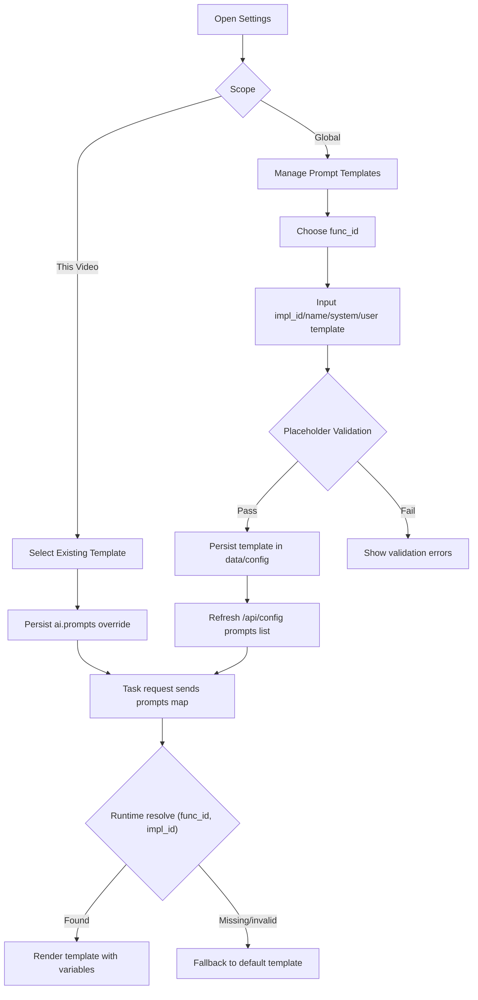

# ✨ feat: Global Prompt Template Library and Runtime Selection

## Overview

Build a global prompt template library stored under `data/config`, and migrate runtime prompt selection from Python hardcoded builders to file-backed templates.

Scope boundary (confirmed):
- Global scope can create/manage templates.
- Video scope cannot create templates; it can only select existing template `impl_id` per `func_id`.
- Existing request contract (`prompts: { func_id: impl_id }`) remains stable.

## Problem Statement

Current architecture only stores prompt *selection* in config and keeps prompt *content* hardcoded in Python builders.

- Prompt selection is persisted as sparse config (`prompts: dict[str, str]`) in `ContentConfig` (`src/deeplecture/domain/entities/config.py:45`, `src/deeplecture/domain/entities/config.py:229`).
- Runtime prompt implementations are registered in code via `create_default_registry()` (`src/deeplecture/use_cases/prompts/registry.py:470`).
- Config API exposes prompt options from registry, not from configurable template files (`src/deeplecture/presentation/api/routes/config.py:60`).

This blocks:
- Non-code prompt management
- Safe template lifecycle (create/validate/deprecate)
- Fast experimentation without backend code changes

## Research Consolidation

### Brainstorm Context Used
- Found brainstorm from 2026-02-13: `docs/brainstorms/2026-02-13-prompt-template-config-brainstorm.md`
- Decision carried forward: “Global template management + video-only selection.”

### Repository Patterns (Local)
- File-backed config storage with atomic write is established:
  - `src/deeplecture/infrastructure/repositories/fs_global_config_storage.py:17`
  - `src/deeplecture/infrastructure/repositories/fs_content_config_storage.py:26`
- Global config merge behavior supports replace-on-write for dictionary fields like prompts/task models:
  - `src/deeplecture/presentation/api/routes/global_config.py:61`
- Prompt UI already consumes backend prompt options and writes `ai.prompts`:
  - `frontend/components/dialogs/settings/PromptTab.tsx:41`
  - `frontend/stores/useGlobalSettingsStore.ts:409`
  - `frontend/components/dialogs/settings/useSettingsScope.ts:304`
- Video-level effective prompt map merges global and per-video overrides by key:
  - `frontend/lib/api/ai-overrides.ts:48`

### Institutional Learnings (`docs/solutions`)
- Relevant file:
  - `docs/solutions/logic-errors/context-mode-unification-note-quiz-cheatsheet-20260212.md`
- Key reusable insight:
  - Policy must be unified across frontend/API/use case layers.
  - Shared helper path reduces drift and regressions.
- Implication for this feature:
  - Introduce one canonical prompt template policy path and avoid per-feature ad hoc parsing.

### External Research Decision
- Skipped external research.
- Reason: feature is internal architecture/configuration refactor with strong in-repo patterns and no high-risk third-party API dependency.

## User Flow Overview (SpecFlow)



## Flow Permutations Matrix (SpecFlow)

| Flow | User State | Scope | Input State | Expected Outcome |
|---|---|---|---|---|
| Create global template | Admin/user with settings access | Global | valid placeholders | Template saved and selectable |
| Create global template | Admin/user with settings access | Global | missing required placeholders | 400 + field-level error details |
| Select template | Existing video | This Video | selected `impl_id` exists | override saved in `ai.prompts` |
| Select template | Existing video | This Video | selected `impl_id` deleted later | runtime fallback to default + warning log |
| Generate task | Any | N/A | custom template render success | task runs with custom prompt |
| Generate task | Any | N/A | template render fails | deterministic fallback to default template |
| Reset video override | Existing video | This Video | clear one `func_id` | inherit global prompt selection |

## Missing Elements & Gaps Identified

### 1. Validation Contract Gap
- Category: Validation
- Gap: No schema for per-`func_id` required/allowed placeholders.
- Impact: Invalid templates may fail at runtime.

### 2. Template Lifecycle Gap
- Category: Data Governance
- Gap: Delete/update behavior for in-use templates is unspecified.
- Impact: Broken video/global references after template edits/deletes.

### 3. API Boundary Gap
- Category: API Design
- Gap: No CRUD endpoint currently exists for prompt template library.
- Impact: Frontend cannot implement global template management.

### 4. Migration Gap
- Category: Release Safety
- Gap: No explicit migration plan from Python builders to file templates.
- Impact: Behavior drift or production fallback surprises.

## Critical Questions Requiring Clarification (with default assumptions)

1. Critical: Deletion policy for templates that are currently referenced?
- Why it matters: prevents broken selections.
- Default assumption in this plan: soft-delete is out of scope; hard delete is blocked when referenced.

2. Critical: Unknown placeholders should be rejected or warned?
- Why it matters: template safety and future extensibility.
- Default assumption in this plan: strict mode in Phase 1 (reject unknown placeholders).

3. Important: Should custom templates be editable in Phase 1?
- Why it matters: API/UI complexity and audit behavior.
- Default assumption in this plan: Phase 1 supports create + list + select only; edit/delete in Phase 2.

4. Important: Should global prompt default per `func_id` be reconfigurable?
- Why it matters: fallback semantics when no override exists.
- Default assumption in this plan: keep current default from builtin set; custom defaults deferred.

## Proposed Solution

## Technical Approach

### Architecture

1. Add a file-backed `PromptTemplateLibrary` in infrastructure.
2. Add a runtime resolver path:
- First read template from library by `(func_id, impl_id)`
- Then render with variables and placeholder validation
- Fallback to builtin default implementation if resolve/render fails
3. Keep `PromptRegistry` interface behavior for use cases to avoid broad call-site changes.

### Data Model

Create `data/config/prompt_templates.json`:

```json
{
  "version": 1,
  "templates": [
    {
      "func_id": "ask_video",
      "impl_id": "default",
      "name": "Default",
      "description": "Teaching assistant style",
      "system_template": "...",
      "user_template": "...",
      "required_placeholders": ["language", "question"],
      "source": "default",
      "created_at": "2026-02-13T00:00:00Z",
      "updated_at": "2026-02-13T00:00:00Z",
      "active": true
    }
  ]
}
```

### API Changes

- New global template endpoints:
  - `GET /api/prompt-templates`
  - `POST /api/prompt-templates`
  - (Phase 2) `PUT /api/prompt-templates/<func_id>/<impl_id>`
  - (Phase 2) `DELETE /api/prompt-templates/<func_id>/<impl_id>`
- `GET /api/config` prompt options source shifts from hardcoded registry list to template library projection.

### Frontend Changes

- Global scope (`PromptTab`): add “Create Template” UX with placeholder hints.
- Video scope (`PromptTab`): selection only; no create/edit controls.
- Keep existing per-video override writing logic unchanged.

### Placeholder Validation

- Add `func_id -> placeholder schema` map (required + allowed tokens).
- Validate template text on create/update:
  - required tokens present
  - unknown tokens rejected
  - `impl_id` uniqueness under `func_id`

### Fallback Strategy

- On runtime template resolution failure:
  - log structured warning with `func_id`, `impl_id`, reason
  - fallback to builtin default prompt implementation
  - continue task execution (no hard fail)

## Implementation Phases

### Phase 1: Foundation (Data + Domain + Infra)

Deliverables:
- [ ] Add template entities/value objects in `src/deeplecture/domain/entities/` (new file: `prompt_template.py`).
- [ ] Add repository protocol in `src/deeplecture/use_cases/interfaces/` (new file: `prompt_template_library.py`).
- [ ] Implement JSON file storage in `src/deeplecture/infrastructure/repositories/fs_prompt_template_library.py` using atomic write pattern.
- [ ] Add bootstrap migration utility script `scripts/migrate_builtin_prompts_to_templates.py` to export current defaults.

Success Criteria:
- [ ] Library loads from `data/config/prompt_templates.json`.
- [ ] Missing file bootstraps from builtin defaults.
- [ ] All reads/writes are atomic and idempotent.

Estimated Effort: 1.5-2.0 days

### Phase 2: Runtime Resolution + Validation

Deliverables:
- [ ] Add placeholder schema registry in `src/deeplecture/use_cases/prompts/placeholder_schema.py`.
- [ ] Implement validator in `src/deeplecture/use_cases/prompts/template_validation.py`.
- [ ] Extend prompt registry adapter in `src/deeplecture/use_cases/prompts/registry.py` to resolve from library first and fallback to builtin.
- [ ] Add structured warnings in `src/deeplecture/use_cases/shared/` or existing logger path.

Success Criteria:
- [ ] Valid custom templates render correctly for at least `ask_video`, `note_outline`, `subtitle_enhance_translate`.
- [ ] Invalid template selections always fallback to default without task failure.
- [ ] Existing task behavior remains backward compatible when no custom template exists.

Estimated Effort: 1.5-2.0 days

### Phase 3: API Layer + Settings Integration

Deliverables:
- [ ] Add routes in `src/deeplecture/presentation/api/routes/prompt_templates.py` (GET/POST for Phase 1 scope).
- [ ] Register route in `src/deeplecture/presentation/api/app.py`.
- [ ] Update `src/deeplecture/presentation/api/routes/config.py` prompts payload to source from template library.
- [ ] Keep `global-config` and `content-config` payload contracts unchanged.

Success Criteria:
- [ ] `/api/config` still returns `prompts: Record<string, PromptFunctionConfig>` shape.
- [ ] `POST /api/prompt-templates` enforces validation and returns useful errors.
- [ ] Existing config endpoints remain compatible with current frontend clients.

Estimated Effort: 1.0-1.5 days

### Phase 4: Frontend Global Template Creation UI

Deliverables:
- [ ] Add API client in `frontend/lib/api/` (new file: `promptTemplates.ts`).
- [ ] Extend prompt tab UI `frontend/components/dialogs/settings/PromptTab.tsx`:
  - global scope: create template action
  - video scope: hide create/edit actions
- [ ] Add lightweight create dialog component `frontend/components/dialogs/settings/PromptTemplateCreateDialog.tsx`.
- [ ] Keep selection save behavior via existing store actions.

Success Criteria:
- [ ] User can create global template from Settings → Prompt (Global).
- [ ] New template appears in dropdown immediately after creation.
- [ ] This Video scope can only select existing templates.

Estimated Effort: 1.0-1.5 days

### Phase 5: Testing, Migration Verification, Rollout

Deliverables:
- [ ] Backend unit tests:
  - `tests/unit/infrastructure/repositories/test_fs_prompt_template_library.py`
  - `tests/unit/use_cases/prompts/test_template_validation.py`
  - `tests/unit/presentation/api/routes/test_prompt_templates_route.py`
- [ ] Frontend tests for create/select behavior and scope boundaries.
- [ ] Migration dry-run doc with rollback steps in `docs/`.

Success Criteria:
- [ ] Tests cover create/list/select/fallback/error paths.
- [ ] Migration script is repeatable and safe.
- [ ] No regression in existing generation flows.

Estimated Effort: 1.0 day

## Alternative Approaches Considered

1. Keep Python hardcoded prompts and improve labels only
- Rejected: does not satisfy configuration ownership and runtime template extensibility.

2. Allow per-video template creation
- Rejected for Phase 1: governance complexity and template sprawl.

## Acceptance Criteria

### Functional Requirements
- [ ] Prompt template text is file-backed under `data/config`.
- [ ] Users can create global prompt templates for supported `func_id`.
- [ ] Video scope cannot create templates; can only select from global list.
- [ ] Runtime resolves by `(func_id, impl_id)` and supports deterministic fallback.
- [ ] Existing request payload and override behavior stay backward compatible.

### Non-Functional Requirements
- [ ] All file writes are atomic.
- [ ] Validation errors are deterministic and user-readable.
- [ ] Fallback path never causes task crash for missing custom templates.

### Quality Gates
- [ ] Unit tests added for storage, validation, API routes, and runtime fallback.
- [ ] Frontend behavior validated for both Global and This Video scopes.
- [ ] Documentation updated for template JSON schema and placeholder contract.

## Success Metrics

- 100% of prompt implementations discoverable from `data/config/prompt_templates.json` after migration.
- 0 production task failures caused by missing/invalid custom templates (fallback should absorb).
- Global template create-to-select roundtrip under 2 seconds in local environment.

## Dependencies & Prerequisites

- Existing prompt builder functions remain temporarily available for fallback path.
- New storage file path must be writable under `data/config`.
- Frontend settings dialog already supports prompt selection and can be extended incrementally.

## Risk Analysis & Mitigation

- Risk: template deletion breaks existing selections
  - Mitigation: block delete when referenced; defer delete API to Phase 2.
- Risk: placeholder contract drift across functions
  - Mitigation: single placeholder schema map + tests.
- Risk: migration mismatch with builtin text
  - Mitigation: deterministic export script and snapshot tests.
- Risk: frontend/backed payload drift
  - Mitigation: preserve existing `AppConfigResponse.prompts` shape (`frontend/lib/api/types.ts:371`).

## Resource Requirements

- Backend: Python engineer familiar with use-case and repository layers.
- Frontend: TypeScript/React engineer for settings dialog extension.
- QA: one focused pass on prompt generation tasks across major features.

## Future Considerations

- Template edit/version history and rollback UX.
- Template soft-delete and deprecation metadata.
- Policy to allow non-strict unknown placeholders under feature flag.
- Optional provider-managed model schema UI (separate initiative, not part of this plan).

## Documentation Plan

- Add prompt template schema documentation in `docs/` (new file: `docs/prompt-template-library.md`).
- Update settings docs to explain Global-create vs Video-select behavior.
- Add migration and rollback runbook notes.

## References & Research

### Internal References
- Brainstorm decisions: `docs/brainstorms/2026-02-13-prompt-template-config-brainstorm.md`
- Prompt registry + defaults: `src/deeplecture/use_cases/prompts/registry.py:25`, `src/deeplecture/use_cases/prompts/registry.py:470`
- Config endpoint prompt projection: `src/deeplecture/presentation/api/routes/config.py:60`
- Global config merge semantics: `src/deeplecture/presentation/api/routes/global_config.py:61`
- Content config prompts validation: `src/deeplecture/presentation/api/routes/content_config.py:190`
- Config entity prompt mapping: `src/deeplecture/domain/entities/config.py:45`
- FS storage atomic write pattern: `src/deeplecture/infrastructure/repositories/fs_global_config_storage.py:40`, `src/deeplecture/infrastructure/repositories/fs_content_config_storage.py:63`
- Frontend prompt selector: `frontend/components/dialogs/settings/PromptTab.tsx:29`
- Frontend global prompt persistence: `frontend/stores/useGlobalSettingsStore.ts:409`
- Video-level prompt override behavior: `frontend/components/dialogs/settings/useSettingsScope.ts:304`, `frontend/lib/api/ai-overrides.ts:48`

### Institutional Learnings
- `docs/solutions/logic-errors/context-mode-unification-note-quiz-cheatsheet-20260212.md`
  - Apply one shared policy path across frontend/API/use-case layers to avoid semantic drift.

### External References
- None used (intentionally skipped based on local-context sufficiency and low external risk).

## Execution Checklist

- [ ] Confirm open questions assumptions (delete policy, strict placeholder mode).
- [ ] Approve Phase 1 scope (create/list/select only).
- [ ] Start implementation with Phase 1 deliverables.
