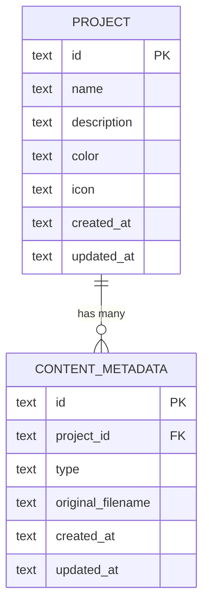

# feat: Projects (Folder-based Course Organization)

## Overview

Add a "Projects" feature that lets users group content (videos/slides) into named folders. The homepage gains a collapsible sidebar for project navigation; the content grid filters by selected project. Projects are optional — ungrouped content remains accessible.

## Problem Statement

All content lives in a single flat list sorted by creation time. Users with 20+ items from different courses cannot quickly find or organize related content. There is no grouping, categorization, or folder concept anywhere in the system.

## Proposed Solution

Introduce a `Project` entity with a one-to-many relationship to `ContentMetadata` (each content belongs to at most one project). The homepage layout changes from single-column to sidebar + content grid. A new `/api/projects` CRUD API is added, and `/api/content/list` gains a `?project_id=` filter parameter.

## Data Model

### New `projects` Table (in `metadata.db`)

| Column       | Type    | Constraint       | Notes                     |
|--------------|---------|------------------|---------------------------|
| `id`         | TEXT    | PRIMARY KEY      | UUID                      |
| `name`       | TEXT    | NOT NULL         | 1-100 chars               |
| `description`| TEXT    |                  | Optional, max 500 chars   |
| `color`      | TEXT    |                  | Hex string, e.g. `#3B82F6`|
| `icon`       | TEXT    |                  | Emoji character           |
| `created_at` | TEXT    | NOT NULL         | ISO-8601 UTC              |
| `updated_at` | TEXT    | NOT NULL         | ISO-8601 UTC              |

### Modified `content_metadata` Table

| Column       | Type    | Change           | Notes                     |
|--------------|---------|------------------|---------------------------|
| `project_id` | TEXT    | ADD COLUMN       | Nullable, application-level FK |

> **Design decision:** No SQLite FK constraint. The codebase does not enable `PRAGMA foreign_keys` and uses application-level integrity checks throughout. `project_id` is a nullable TEXT column added via the existing `_ensure_columns()` pattern.

### ERD



## Resolved Open Questions

| Question | Decision | Rationale |
|----------|----------|-----------|
| Project deletion behavior | Content becomes ungrouped (`project_id` → NULL) | Non-destructive; users never lose content |
| Move-content API contract | `PATCH /api/content/<id>` with `{"project_id": "<id>"}` or `{"project_id": null}` | Reuses existing content endpoint pattern, minimal new surface |
| "Ungrouped" query parameter | `GET /api/content/list?project_id=none` | `none` is a reserved sentinel; omitting `project_id` = show all |
| Project assignment on all upload paths | Yes — local upload, URL import, and bilibili/youtube all support optional `project_id` | Consistent experience across all upload methods |
| Project name validation | Required, 1-100 chars, trimmed, duplicates allowed | Simple; no uniqueness constraint needed for personal use |
| Color system | Predefined palette of 12 colors, stored as hex | Prevents jarring custom colors, simpler UI (color picker → palette) |
| Icon system | Emoji character (string) | No icon library dependency; universal rendering |
| Sidebar sort order | Projects sorted by `created_at DESC` (newest first) | Matches content sort; no manual reordering (YAGNI) |
| Mobile sidebar | Slide-over drawer, triggered by a toggle button | Standard responsive pattern |
| Bulk operations | Deferred to future iteration | MVP focuses on single-item operations |
| URL state | `?project=<id>` query param on homepage | Enables bookmarking and browser back/forward |
| Context menu implementation | Dropdown menu on existing "more actions" button, not right-click | Better accessibility; consistent with existing hover-action pattern |

## API Design

### New Endpoints: `/api/projects`

#### `GET /api/projects` — List all projects

**Response:**
```json
{
  "success": true,
  "data": {
    "projects": [
      {
        "id": "uuid",
        "name": "Linear Algebra",
        "description": "MIT 18.06",
        "color": "#3B82F6",
        "icon": "📐",
        "content_count": 30,
        "created_at": "2026-03-08T12:00:00Z",
        "updated_at": "2026-03-08T12:00:00Z"
      }
    ],
    "count": 1
  }
}
```

> `content_count` is computed via `SELECT COUNT(*)` join, not stored.

#### `POST /api/projects` — Create project

**Request:**
```json
{
  "name": "Linear Algebra",
  "description": "MIT 18.06",
  "color": "#3B82F6",
  "icon": "📐"
}
```

#### `PUT /api/projects/<id>` — Update project

**Request:** Same shape as create (partial updates allowed).

#### `DELETE /api/projects/<id>` — Delete project

Sets `project_id = NULL` on all associated content, then deletes the project row.

### Modified Endpoint: `/api/content/list`

| Parameter    | Type   | Default | Notes                              |
|--------------|--------|---------|------------------------------------|
| `project_id` | string | (omit)  | UUID to filter; `"none"` for ungrouped; omit for all |

### Modified Endpoint: `PATCH /api/content/<id>`

New field in request body:

```json
{
  "project_id": "uuid-or-null"
}
```

Setting `project_id` to `null` removes the content from its project.

### Modified Upload Endpoints

`POST /api/content/upload` and `POST /api/content/import-url` gain an optional `project_id` field in the request body/form data.

## Implementation Phases

### Phase 1: Backend — Domain + Storage

**Files to create/modify:**

- `src/deeplecture/domain/entities/project.py` (new)

```python
@dataclass(slots=True)
class Project:
    id: str
    name: str
    description: str = ""
    color: str = ""
    icon: str = ""
    created_at: datetime = field(default_factory=...)
    updated_at: datetime = field(default_factory=...)
```

- `src/deeplecture/domain/entities/__init__.py` — export `Project`
- `src/deeplecture/domain/__init__.py` — export `Project`
- `src/deeplecture/use_cases/interfaces/project.py` (new) — `ProjectStorageProtocol`

```python
@runtime_checkable
class ProjectStorageProtocol(Protocol):
    def get(self, project_id: str) -> Project | None: ...
    def save(self, project: Project) -> None: ...
    def delete(self, project_id: str) -> bool: ...
    def list_all(self) -> list[Project]: ...
    def count_content(self, project_id: str) -> int: ...
```

- `src/deeplecture/infrastructure/repositories/sqlite_project.py` (new) — `SQLiteProjectStorage`
  - Creates `projects` table in same `metadata.db`
  - Standard CRUD following `SQLiteMetadataStorage` patterns
  - `count_content()` queries `content_metadata WHERE project_id = ?`
- `src/deeplecture/infrastructure/repositories/sqlite_metadata.py`
  - Add `"project_id": "TEXT"` to `_OPTIONAL_COLUMNS`
  - Add `project_id` to `_row_to_entity()` mapping
  - Modify `list_all()` to accept optional `project_id` filter:
    - `None` → no WHERE clause (all content)
    - `"none"` → `WHERE project_id IS NULL`
    - UUID string → `WHERE project_id = ?`
  - Add `update_project_id(content_id, project_id)` method
  - Add `clear_project_id(project_id)` method (for project deletion cascade)
- `src/deeplecture/domain/entities/content.py` — add `project_id: str | None = None` field

### Phase 2: Backend — Use Case + API

**Files to create/modify:**

- `src/deeplecture/use_cases/project.py` (new) — `ProjectUseCase`
  - `create_project(name, description, color, icon) -> Project`
  - `update_project(id, **fields) -> Project`
  - `delete_project(id) -> bool` (nullifies content project_id, then deletes)
  - `list_projects() -> list[dict]` (includes content_count)
  - `assign_content(content_id, project_id) -> None`
  - `unassign_content(content_id) -> None`
- `src/deeplecture/presentation/api/routes/project.py` (new) — Blueprint `project_bp`
  - `GET /api/projects` → `list_projects`
  - `POST /api/projects` → `create_project`
  - `PUT /api/projects/<id>` → `update_project`
  - `DELETE /api/projects/<id>` → `delete_project`
- `src/deeplecture/presentation/api/routes/content.py`
  - Modify list endpoint to accept `project_id` query param
  - Add `PATCH /<id>` route for project assignment (or extend rename endpoint)
- `src/deeplecture/presentation/api/routes/__init__.py` — export `project_bp`
- `src/deeplecture/presentation/api/app.py` — register blueprint with `/api/projects` prefix
- `src/deeplecture/presentation/api/shared/validation.py` — add `validate_project_name()`
- `src/deeplecture/di/container.py`
  - Add `project_storage` property → `SQLiteProjectStorage`
  - Add `project_usecase` property → `ProjectUseCase`
- Upload routes (`upload.py`) — accept optional `project_id` in form data / request body

### Phase 3: Frontend — Types + API Client

**Files to create/modify:**

- `frontend/lib/api/types.ts`
  - Add `Project` interface
  - Add optional `projectId?: string | null` to `ContentItem`

```typescript
// === PROJECTS ===
export interface Project {
  id: string;
  name: string;
  description: string;
  color: string;
  icon: string;
  contentCount: number;
  createdAt: string;
  updatedAt: string;
}

export interface ProjectListResponse {
  projects: Project[];
  count: number;
}
```

- `frontend/lib/api/project.ts` (new)
  - `listProjects(): Promise<ProjectListResponse>`
  - `createProject(data): Promise<Project>`
  - `updateProject(id, data): Promise<Project>`
  - `deleteProject(id): Promise<void>`
  - `assignContentToProject(contentId, projectId): Promise<void>`
- `frontend/lib/api/content.ts` — add optional `projectId` param to `listContent()`
- `frontend/lib/api/index.ts` — re-export project APIs

### Phase 4: Frontend — Sidebar + Layout

**Files to create/modify:**

- `frontend/components/projects/ProjectSidebar.tsx` (new)
  - Fetches project list via `listProjects()`
  - Renders "All", project entries (with color dot + icon + name + count), "Ungrouped"
  - Highlights active selection
  - "[+ New]" button opens `CreateProjectDialog`
  - Collapsible via toggle button; state persisted in `localStorage`
  - On mobile (< 768px): renders as slide-over drawer
- `frontend/components/projects/CreateProjectDialog.tsx` (new)
  - Form fields: name (required), description, color palette picker, emoji picker
  - Calls `createProject()` on submit
- `frontend/components/projects/EditProjectDialog.tsx` (new)
  - Pre-filled form for editing project properties
  - Calls `updateProject()` on submit
- `frontend/app/page.tsx`
  - Restructure layout: sidebar + main content area using flex
  - Pass `selectedProjectId` state to `VideoList`
  - Update URL query param `?project=<id>` on project selection
  - Read `?project=` from URL on mount for deep linking
- `frontend/components/video/VideoList.tsx`
  - Accept optional `projectId` prop
  - Pass to `listContent({ projectId })` API call
  - Re-fetch when `projectId` changes
- `frontend/components/video/VideoUpload.tsx`
  - Add optional project dropdown to all upload tabs (local, URL import)
  - Default to currently selected project from sidebar context

### Phase 5: Frontend — Content Card Actions

**Files to modify:**

- `frontend/components/video/VideoList.tsx` (or extracted card component)
  - Add "Move to Project..." option in existing hover action buttons
  - Opens a small dropdown/popover listing all projects + "Remove from project"
  - Calls `assignContentToProject()` or `unassignContent()` on selection
  - When viewing "All", show a small project color indicator on each card

## Acceptance Criteria

### Functional

- [ ] User can create a project with name, description, color, and icon
- [ ] User can view all projects in a collapsible sidebar
- [ ] Clicking a project in the sidebar filters the content grid to that project only
- [ ] "All" shows all content; "Ungrouped" shows content with no project
- [ ] User can assign a project during any upload method (local, URL, YouTube/Bilibili)
- [ ] User can move existing content to a project via card action menu
- [ ] User can remove content from a project (back to ungrouped) via card action menu
- [ ] User can edit project name, description, color, and icon
- [ ] User can delete a project — its content becomes ungrouped
- [ ] Project filter state is reflected in the URL (`?project=<id>`)
- [ ] Sidebar collapse state persists across page loads (localStorage)
- [ ] Sidebar renders as slide-over drawer on mobile screens

### Non-Functional

- [ ] Project list query is O(n) where n = number of projects (not content)
- [ ] Content list filtering uses indexed `project_id` column
- [ ] No breaking changes to existing API responses (backward compatible)

## Testing Strategy

### Backend Tests

- `tests/unit/domain/entities/test_project.py` — entity creation, validation, defaults
- `tests/unit/use_cases/test_project.py` — use case logic (create, delete cascade, assign/unassign)
- `tests/integration/presentation/api/test_project_api.py` — full CRUD API tests
- `tests/integration/presentation/api/test_content_api.py` — add tests for `?project_id=` filter

### Frontend Tests

- `frontend/lib/__tests__/project.test.ts` — API client functions
- Component tests for `ProjectSidebar`, `CreateProjectDialog` if test infrastructure exists

## References

- Brainstorm: `docs/brainstorms/2026-03-08-projects-brainstorm.md`
- Vertical slice pattern: `docs/plans/2026-02-12-feat-video-bookmarks-module-plan.md`
- Schema evolution: `src/deeplecture/infrastructure/repositories/sqlite_metadata.py:18-64`
- Content entity: `src/deeplecture/domain/entities/content.py:69`
- DI wiring pattern: `src/deeplecture/di/container.py:517-526`
- Route registration: `src/deeplecture/presentation/api/app.py:55`
- Frontend content list: `frontend/components/video/VideoList.tsx`
- Frontend homepage: `frontend/app/page.tsx`
- Cross-layer unification lesson: `docs/solutions/logic-errors/context-mode-unification-note-quiz-cheatsheet-20260212.md`
