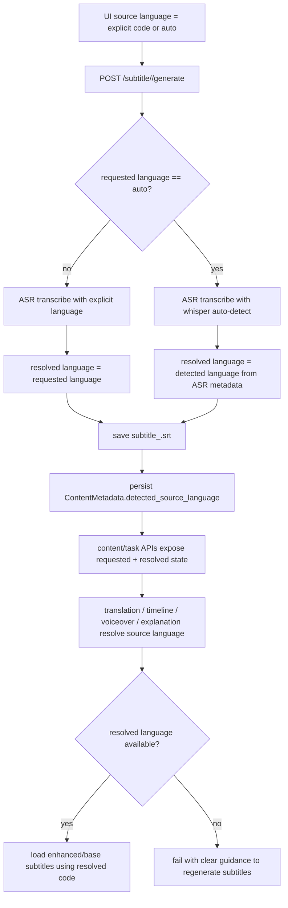

# feat: Add source-language auto detection

## Overview

Add an `Auto` option for source language in the video workflow so subtitle generation can use Whisper's language auto-detection, persist the resolved language, and reuse that resolved language across downstream tasks that depend on source subtitles. The change must preserve current slide-only behavior, avoid creating `subtitle_auto.srt` artifacts, and surface enough metadata for the UI to explain what language was actually detected.

## Problem Frame

Today `Source Language` is treated as an already-known concrete language code everywhere in the stack. The frontend only offers explicit language codes, API validation rejects non-codes, and backend subtitle generation saves artifacts under the requested language key. That works for explicit language selection, but it prevents the common case where a user wants the system to infer the spoken language from the audio.

The difficulty is not the Whisper invocation itself. The local `whisper.cpp` binary already supports `-l auto` for auto-detect. The real cross-cutting problem is that downstream features such as subtitle translation, timeline generation, voiceover generation, and explanation context all treat `source_language` as the canonical subtitle storage key. If we only add `Auto` as a UI sentinel and pass `"auto"` through untouched, those features will later look for `subtitle_auto.srt` or `auto_enhanced`, which is incorrect.

## Requirements Trace

- R1. Users can select `Auto` as the source language for audio-backed content flows.
- R2. Subtitle generation accepts `auto`, invokes Whisper auto-detection, and stores subtitles under the resolved real language code.
- R3. The resolved source language is persisted so downstream tasks can reuse it without guessing.
- R4. Source-subtitle consumers reuse the resolved language instead of the raw `auto` sentinel.
- R5. UI surfaces enough state to explain `Auto` plus the detected language after generation completes.
- R6. Slide-only flows do not silently misbehave when `Source Language` is `Auto`; they must either use a resolved subtitle-backed language or fail with a clear, actionable message.
- R7. Validation, persistence, and cross-layer behavior are covered by targeted backend and frontend tests.

## Scope Boundaries

- No external research or framework migration is needed; the repo already has strong local patterns for Flask routes, per-content config, and subtitle fallback.
- No retrospective backfill is required for old content that has no persisted detected language. First release may require regenerating subtitles when a video is switched to `Auto` and no resolved language is known yet.
- No attempt should be made to store subtitle artifacts under both `auto` and the resolved language. The real language remains the only artifact key.
- No behavior change is planned for target language selection.
- No change is planned for non-subtitle text-generation tasks that already operate purely on output language unless they consume source subtitle context.

## Context & Research

### Relevant Code and Patterns

- `src/deeplecture/infrastructure/gateways/whisper.py` already shells out to `whisper-cli` and is the correct place to add auto-detect-aware transcription behavior.
- `src/deeplecture/presentation/api/shared/validation.py` centralizes request validation and currently rejects `"auto"` as a language value.
- `src/deeplecture/use_cases/subtitle.py` owns ASR transcription and subtitle persistence, so it is the correct seam for converting a requested sentinel into a resolved language artifact.
- `src/deeplecture/use_cases/shared/subtitle.py` already centralizes subtitle fallback policy (`enhanced -> base`) and should remain the single source of truth for source-subtitle resolution.
- `src/deeplecture/domain/entities/content.py` plus `src/deeplecture/infrastructure/repositories/sqlite_metadata.py` provide an existing additive metadata/persistence path for new per-content fields.
- `src/deeplecture/presentation/api/routes/content.py` and `src/deeplecture/presentation/api/routes/task.py` are the existing surfaces for exposing runtime metadata back to the frontend.
- `frontend/lib/languages.ts`, `frontend/components/dialogs/settings/GeneralTab.tsx`, and `frontend/components/dialogs/VideoConfigPanel.tsx` are the current source-language selector surfaces.
- `frontend/hooks/handlers/useSubtitleHandlers.ts`, `frontend/lib/api/subtitle.ts`, `frontend/lib/api/explanation.ts`, and `frontend/hooks/useVideoPageState.ts` already coordinate generation actions and task-driven UI refresh.

### Institutional Learnings

- `docs/solutions/logic-errors/context-mode-unification-note-quiz-cheatsheet-20260212.md` is directly relevant: the repo previously removed a hidden `auto` mode in context selection because partial acceptance across layers caused policy drift. This plan should not reintroduce that failure mode. If `auto` becomes valid again, every affected layer must share one explicit resolution policy.
- The same solution document also reinforces that source-subtitle preference should be centralized in shared helpers rather than reimplemented independently in each use case.

### Related Planning History

- `docs/brainstorms/2026-02-10-cascading-task-config-brainstorm.md`
- `docs/plans/2026-02-10-feat-cascading-task-configuration-plan.md`
- `docs/plans/2026-02-12-feat-unified-settings-all-pervideo-overrides-plan.md`

These documents explain why `source_language` currently flows through global settings, per-video overrides, and task payloads as a generic string. The `Auto` design must fit that cascade without letting unresolved sentinels leak into task consumers that require a concrete subtitle key.

### External References

- Local `whisper.cpp` CLI help and source confirm `-l auto` is supported and that the engine treats `nullptr`, empty string, or `"auto"` as auto-detect inputs.

## Key Technical Decisions

- Store the detected source language on `ContentMetadata`, not only in task metadata or `ContentConfig`.
  - Rationale: downstream tasks need a durable, content-scoped resolved language even after page reloads or new task submissions. Task metadata is too ephemeral, and `ContentConfig` should continue to represent user intent (`auto` vs explicit code), not the last observed runtime result.

- Keep `auto` as a requested/configured value and introduce a separate resolved language path.
  - Rationale: this preserves the user’s intent while allowing backend consumers to operate on a concrete language key.

- Save subtitle artifacts only under the resolved language code.
  - Rationale: storage, fallback helpers, and every consumer already assume subtitle artifact keys are real language codes.

- Centralize source-language resolution behind a backend helper instead of teaching each route/use case to interpret `auto`.
  - Rationale: this mirrors the shared subtitle fallback helpers and avoids the drift called out in the institutional learning.

- Treat slide-only generation as explicit-language-only when no resolved source subtitle language exists.
  - Rationale: `Source Language` currently feeds both audio-backed and slide-backed workflows. Audio auto-detect makes sense only when there is spoken audio or an already-resolved subtitle source. Slide-only tasks should fail clearly rather than guessing.

- Return resolved/detected language metadata to the frontend through existing content/task API surfaces.
  - Rationale: the UI needs to display `Auto (detected: ja)` and make better decisions after subtitle generation completes.

## Open Questions

### Resolved During Planning

- Where should the detected language live?
  - Resolution: add a nullable `detected_source_language` field to `ContentMetadata` and SQLite persistence.

- Should `"auto"` ever become a subtitle artifact key?
  - Resolution: no. Only resolved real language codes are valid subtitle storage keys.

- Should `Auto` affect every source-language consumer equally?
  - Resolution: no. It is valid as a requested state for audio-backed subtitle generation, but consumers that require a concrete subtitle key must resolve it first and fail clearly if resolution is impossible.

- Should external research be included?
  - Resolution: no. The repo already contains strong local patterns and the Whisper integration is local and inspectable.

### Deferred to Implementation

- Whether the ASR layer should always emit JSON metadata or only emit JSON when `language == "auto"`.
  - This depends on the cleanest gateway implementation once the exact `whisper-cli` output shape is wired into tests.

- Whether the frontend should show `Auto` in every source-language selector or selectively hide it for slide-only content.
  - The plan assumes the UI will guide users away from invalid slide-only actions, but the exact affordance can be decided during implementation with the existing settings component constraints in hand.

- Whether legacy content with multiple existing subtitle languages should get any best-effort inference path when `detected_source_language` is missing.
  - This is intentionally deferred because correctness depends on real stored subtitle sets, and a naive inference strategy could be wrong.

## High-Level Technical Design

> *This illustrates the intended approach and is directional guidance for review, not implementation specification. The implementing agent should treat it as context, not code to reproduce.*



## Implementation Units

- [x] **Unit 1: Introduce configured-vs-detected source language state in backend metadata**

**Goal:** Create a durable, content-scoped place to persist the resolved source language independently from the configured `source_language` intent.

**Requirements:** R2, R3, R4, R5

**Dependencies:** None

**Files:**
- Modify: `src/deeplecture/domain/entities/content.py`
- Modify: `src/deeplecture/infrastructure/repositories/sqlite_metadata.py`
- Modify: `src/deeplecture/presentation/api/routes/content.py`
- Modify: `src/deeplecture/presentation/api/routes/task.py`
- Modify: `frontend/lib/api/types.ts`
- Test: `tests/unit/domain/entities/test_content.py`
- Test: `tests/unit/use_cases/test_content.py`
- Test: `tests/integration/presentation/api/test_task_stream.py`

**Approach:**
- Add a nullable `detected_source_language` field to `ContentMetadata`.
- Extend SQLite metadata schema using the existing additive `_OPTIONAL_COLUMNS` pattern so current databases upgrade in place.
- Decide on a minimal serialization contract for content/task APIs:
  - content payload should expose the persisted detected language
  - subtitle-generation task metadata should expose both requested language and resolved language when available
- Keep `ContentConfig` unchanged for intent storage. `auto` remains a user/config value there; resolved language belongs to metadata.

**Patterns to follow:**
- Existing additive column pattern in `src/deeplecture/infrastructure/repositories/sqlite_metadata.py`
- Existing content/task serialization in `src/deeplecture/presentation/api/routes/content.py` and `src/deeplecture/presentation/api/routes/task.py`

**Test scenarios:**
- A content metadata record round-trips with `detected_source_language` populated.
- Existing rows without the new column still load correctly after schema evolution.
- Task/status serialization includes resolved language when subtitle generation completes.

**Verification:**
- Content metadata can persist and reload a detected language without breaking older rows.
- Frontend API types can represent the new field without widening unrelated contracts.

- [x] **Unit 2: Make subtitle generation accept `auto` and persist the resolved language**

**Goal:** Allow subtitle generation to request auto-detection, obtain the actual language from Whisper, and save subtitles plus metadata under the resolved language.

**Requirements:** R1, R2, R3, R5, R7

**Dependencies:** Unit 1

**Files:**
- Modify: `src/deeplecture/presentation/api/shared/validation.py`
- Modify: `src/deeplecture/presentation/api/routes/subtitle.py`
- Modify: `src/deeplecture/use_cases/interfaces/services.py`
- Modify: `src/deeplecture/use_cases/dto/subtitle.py`
- Modify: `src/deeplecture/use_cases/subtitle.py`
- Modify: `src/deeplecture/infrastructure/gateways/whisper.py`
- Modify: `frontend/lib/api/subtitle.ts`
- Test: `tests/unit/infrastructure/gateways/test_whisper.py`
- Test: `tests/unit/use_cases/test_subtitle.py`
- Test: `tests/integration/presentation/api/test_route_smoke.py`

**Approach:**
- Update language validation to explicitly allow `"auto"` where source-language requests can legally use it, while keeping the rest of the validation behavior intact.
- Refine the ASR contract so subtitle generation receives both segments and a resolved language, rather than assuming the request language is also the storage language.
- Extend `WhisperASR` to capture the resolved language when auto-detect is requested. The likely implementation is to request machine-readable Whisper output in addition to SRT when `language == "auto"` and parse the reported language from that artifact.
- Persist `detected_source_language` on content metadata whenever the resolved language is known.
- Save subtitle artifacts under the resolved language key and return that resolved language in the subtitle generation result/task metadata.

**Technical design:** *(directional guidance, not implementation specification)*

```text
GenerateSubtitleRequest(requested_language="auto")
  -> SubtitleUseCase.generate()
     -> asr.transcribe(..., language="auto")
        -> returns { segments, resolved_language="ja" }
     -> subtitle_storage.save(content_id, segments, "ja")
     -> metadata.detected_source_language = "ja"
     -> SubtitleResult.language = "ja"
```

**Patterns to follow:**
- Route validation and task submission structure in `src/deeplecture/presentation/api/routes/subtitle.py`
- Existing use-case-owned status updates in `src/deeplecture/use_cases/subtitle.py`

**Test scenarios:**
- `POST /subtitle/<id>/generate` accepts `"auto"` and no longer returns `400`.
- Explicit languages still behave exactly as before.
- Auto-detect transcription returns a resolved real language and saves `subtitle_<resolved>.srt`.
- Failed auto-detect leaves content in an error state without writing `subtitle_auto.srt`.

**Verification:**
- A completed subtitle-generation task can report a concrete resolved language after an `auto` request.
- No code path persists or loads `subtitle_auto.srt`.

- [x] **Unit 3: Centralize source-language resolution for downstream subtitle consumers**

**Goal:** Ensure every feature that consumes source subtitles can convert `auto` into a concrete subtitle key or fail clearly when resolution is unavailable.

**Requirements:** R3, R4, R6, R7

**Dependencies:** Unit 2

**Files:**
- Create: `src/deeplecture/use_cases/shared/source_language.py`
- Modify: `src/deeplecture/use_cases/shared/subtitle.py`
- Modify: `src/deeplecture/presentation/api/routes/subtitle.py`
- Modify: `src/deeplecture/presentation/api/routes/timeline.py`
- Modify: `src/deeplecture/presentation/api/routes/voiceover.py`
- Modify: `src/deeplecture/presentation/api/routes/explanation.py`
- Modify: `src/deeplecture/presentation/api/routes/media.py`
- Modify: `src/deeplecture/presentation/api/routes/generation.py`
- Modify: `src/deeplecture/use_cases/timeline.py`
- Modify: `src/deeplecture/use_cases/voiceover.py`
- Modify: `src/deeplecture/use_cases/explanation.py`
- Test: `tests/unit/use_cases/shared/test_subtitle.py`
- Test: `tests/unit/use_cases/test_timeline.py`
- Test: `tests/unit/use_cases/test_voiceover.py`
- Test: `tests/integration/presentation/api/test_task_model_resolution_api.py`

**Approach:**
- Add one shared backend helper that receives:
  - requested source language
  - content metadata
  - possibly available subtitle languages
  - optional operation context
  and returns either a concrete source language or a domain-specific failure.
- Use that helper anywhere the system currently treats `source_language` or `subtitle_language` as a concrete subtitle key.
- Preserve the existing enhanced-first fallback logic once a concrete base language has been resolved.
- Explicitly separate two cases:
  - audio-backed subtitle consumers can use persisted `detected_source_language`
  - slide-only routes that require an explicit source language but have no resolved subtitle source should fail fast with a clear message instead of guessing
- Update route-level error messaging so users understand when they need to regenerate subtitles before using translation/timeline/voiceover/explanation with `Auto`.

**Patterns to follow:**
- Shared helper centralization in `src/deeplecture/use_cases/shared/subtitle.py`
- Consistent cross-route validation noted in `docs/solutions/logic-errors/context-mode-unification-note-quiz-cheatsheet-20260212.md`

**Test scenarios:**
- Timeline generation with configured `auto` succeeds when detected language is persisted.
- Voiceover generation with configured `auto` loads `<resolved>_enhanced` then `<resolved>` as usual.
- Explanation generation uses resolved subtitle language for context when available.
- Translation/timeline/voiceover/explanation return a clear failure when source config is `auto` but no detected language is known yet.
- Slide lecture generation rejects unresolved `auto` with an actionable error.

**Verification:**
- No downstream task directly interprets the raw `auto` sentinel as a subtitle storage key.
- Shared resolution policy is used consistently across routes and use cases.

- [x] **Unit 4: Expose `Auto` in the frontend and surface resolved-language feedback**

**Goal:** Let users select `Auto`, keep request payloads aligned with backend expectations, and show detected-language feedback once subtitle generation completes.

**Requirements:** R1, R5, R6, R7

**Dependencies:** Units 1-3

**Files:**
- Modify: `frontend/lib/languages.ts`
- Modify: `frontend/stores/types.ts`
- Modify: `frontend/components/dialogs/settings/GeneralTab.tsx`
- Modify: `frontend/components/dialogs/VideoConfigPanel.tsx`
- Modify: `frontend/hooks/handlers/useSubtitleHandlers.ts`
- Modify: `frontend/hooks/handlers/useSlideHandlers.ts`
- Modify: `frontend/hooks/useVideoPageState.ts`
- Modify: `frontend/lib/api/subtitle.ts`
- Modify: `frontend/lib/api/explanation.ts`
- Modify: `frontend/lib/api/content.ts`
- Modify: `frontend/lib/api/task.ts`
- Modify: `frontend/lib/api/types.ts`
- Test: `frontend/lib/__tests__/api-overrides-payload.test.ts`
- Test: `frontend/lib/__tests__/configResolution.test.ts`

**Approach:**
- Add an `Auto` option to the source-language option list, but keep target-language options unchanged.
- Ensure frontend types accept `"auto"` only where it represents a configured/requested source language, not a resolved subtitle artifact language.
- Update subtitle generation calls to send `"auto"` verbatim when selected.
- Hydrate and retain `detectedSourceLanguage` from content/task responses so the UI can display states such as:
  - `Auto`
  - `Auto (detected: Japanese)`
  - `Auto (regenerate subtitles to detect language)` when unresolved
- Guard UI actions that cannot proceed with unresolved `auto`, especially slide-only generation paths that currently reuse `sourceLanguage`.
- Keep existing task/SSE refresh behavior; only augment the state model with enough metadata to render user-facing feedback.

**Execution note:** Start with payload and state-shape tests so the UI contract for `auto` and `detectedSourceLanguage` is locked before wiring view text.

**Patterns to follow:**
- Existing module-level config resolution in `frontend/lib/api/ai-overrides.ts`
- Existing task-driven refresh handling in `frontend/hooks/useVideoPageState.ts`

**Test scenarios:**
- Source-language dropdown includes `Auto`; target-language dropdown does not.
- Subtitle generation payload sends `"auto"` unchanged.
- Content/task API payload transformation preserves `detectedSourceLanguage`.
- UI state can represent `auto + detected language` without breaking existing explicit-language flows.
- Slide generation path does not silently pass unresolved `auto` into explicit-language-only requests.

**Verification:**
- Users can choose `Auto` from the source-language UI.
- After subtitle generation completes, the UI can render the detected language without a manual refresh hack.

- [x] **Unit 5: Harden cross-layer regression coverage and operational guidance**

**Goal:** Finish the work with end-to-end confidence around the new configured-vs-resolved language model and document the rollout caveats.

**Requirements:** R4, R5, R6, R7

**Dependencies:** Units 1-4

**Files:**
- Modify: `tests/unit/presentation/api/test_content_config_validation.py`
- Modify: `tests/integration/presentation/api/test_task_stream.py`
- Modify: `tests/integration/infrastructure/repositories/test_fs_subtitle_storage.py`
- Modify: `docs/plans/2026-03-28-001-feat-source-language-auto-detection-plan.md`

**Approach:**
- Add targeted regression coverage around the key policy boundaries:
  - `auto` is valid for source-language subtitle generation
  - resolved languages are concrete artifact keys
  - unresolved `auto` yields guided failures, not silent fallback to the wrong artifact
- Document the rollout caveat for existing content: if `detected_source_language` is absent and the user switches to `Auto`, they may need to regenerate subtitles once.
- Call out frontend verification expectations tied to this repo’s local dev workflow, including restarting the `http://localhost:3001` frontend before manual verification after UI changes.

**Patterns to follow:**
- Existing smoke/integration test style in `tests/integration/presentation/api/test_route_smoke.py`
- AGENTS.md project instruction about restarting the frontend dev server before validation

**Test scenarios:**
- Existing explicit-language workflows remain green.
- Auto-detect flow works from request submission through downstream task reuse.
- Regression tests prove that partial support does not creep back in on individual routes.

**Verification:**
- The new behavior is covered at gateway, use-case, route, and frontend payload/state levels.
- Operational notes are explicit enough that implementers and reviewers know how to verify the UI correctly.

## System-Wide Impact

- **Interaction graph:** Source-language state flows through global settings, per-video overrides, subtitle generation, persisted content metadata, task events, and every source-subtitle consumer. This is a true cross-layer change, not a route-local tweak.
- **Error propagation:** Source-language resolution failures should surface as clear user-facing API errors, not as missing-file exceptions from subtitle storage.
- **State lifecycle risks:** A user can configure `auto` before any subtitles exist. That state is valid, but downstream consumers must treat it as unresolved until subtitle generation persists a concrete detected language.
- **API surface parity:** Content metadata, task metadata, route validation, and frontend API types all need to agree on the configured-vs-resolved split.
- **Integration coverage:** Unit tests alone will not prove task payload updates and UI refresh behavior; integration coverage should confirm task/status serialization and downstream reuse.

## Risks & Dependencies

- Parsing detected language from Whisper output is the most implementation-sensitive backend change. If the chosen output format is brittle, it could make subtitle generation less reliable.
- Allowing `auto` in validation without finishing downstream resolution would recreate the exact cross-layer drift warned about in the existing institutional learning.
- The current shared `Source Language` UI feeds both video and slide flows. If implementation does not clearly gate invalid slide-only actions, users will experience confusing failures.
- Existing content with old subtitle artifacts but no detected metadata is a transitional edge case. The plan intentionally prefers explicit failure/guidance over unsafe inference.

## Documentation / Operational Notes

- No separate brainstorm/requirements doc exists for this request, so this plan is the primary artifact.
- Manual frontend verification must follow the repo instruction in `AGENTS.md`: if frontend code changes, ensure the dev server at `http://localhost:3001` has been restarted to the latest code before testing.
- Reviewer guidance should explicitly check that no path introduces or consumes `subtitle_auto.srt`.
- Implementation verification completed with:
  - `uv run pytest tests/unit/infrastructure/gateways/test_whisper.py tests/unit/use_cases/test_subtitle.py tests/unit/presentation/api/test_subtitle_route.py tests/unit/domain/entities/test_content.py tests/unit/use_cases/test_content.py tests/integration/presentation/api/test_task_stream.py tests/unit/use_cases/shared/test_subtitle.py tests/unit/use_cases/shared/test_source_language.py tests/integration/presentation/api/test_media_download_api.py tests/integration/presentation/api/test_source_language_resolution_api.py -q`
  - `npm --prefix frontend run test -- lib/__tests__/api-overrides-payload.test.ts lib/__tests__/sourceLanguage.test.ts`
  - `npm --prefix frontend run typecheck`

## Sources & References

- Related code: `src/deeplecture/infrastructure/gateways/whisper.py`
- Related code: `src/deeplecture/use_cases/subtitle.py`
- Related code: `src/deeplecture/use_cases/shared/subtitle.py`
- Related code: `src/deeplecture/presentation/api/routes/subtitle.py`
- Related code: `frontend/lib/languages.ts`
- Related code: `frontend/components/dialogs/settings/GeneralTab.tsx`
- Related code: `frontend/components/dialogs/VideoConfigPanel.tsx`
- Related plan: `docs/plans/2026-02-10-feat-cascading-task-configuration-plan.md`
- Related plan: `docs/plans/2026-02-12-feat-unified-settings-all-pervideo-overrides-plan.md`
- Institutional learning: `docs/solutions/logic-errors/context-mode-unification-note-quiz-cheatsheet-20260212.md`
- Whisper reference: `whisper.cpp/examples/cli/README.md`
- Whisper reference: `whisper.cpp/include/whisper.h`
