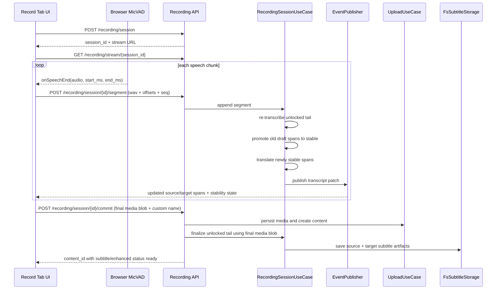

# feat: Add realtime recording subtitle pipeline

## Overview

Add a dedicated recording-session pipeline that lets the Record tab show live source transcription during capture, emit translated text once source segments become stable, and commit the accumulated result into the normal content/subtitle system when recording ends. The first delivery should avoid re-running full subtitle generation after upload: realtime session output becomes the main subtitle artifact, with only the final unstable tail reprocessed during commit.

## Problem Frame

The current recording flow in [docs/brainstorms/2026-03-28-realtime-recording-subtitles-brainstorm.md](docs/brainstorms/2026-03-28-realtime-recording-subtitles-brainstorm.md) captures microphone audio and uploads it only after the user ends recording. That means the user cannot glance at the UI to catch up on what was just said, cannot build trust that speech is being understood, and gets no incremental value from the recording period itself.

This plan turns recording into a staged subtitle pipeline:
- live source text appears during recording
- source text may still be revised within a short draft window
- translation appears only after source segments stabilize
- commit writes normal subtitle artifacts so downstream consumers can reuse them immediately

## Requirements Trace

- R1. Show source-language transcription shortly after recording begins and keep updating it during capture.
  Source: origin R1
- R2. Allow source transcript revision before segments become stable, and reflect that state clearly in the recording UI.
  Source: origin R2
- R3. Trigger translation only for stable source segments so bilingual output is readable rather than constantly thrashing.
  Source: origin R3
- R4. Persist realtime output as the main source of truth for final subtitles instead of treating it as disposable preview state.
  Source: origin R4
- R5. On recording end, finalize only the unstable tail instead of regenerating subtitles for the full recording.
  Source: origin R5
- R6. Save the committed subtitle result in the same storage shape used by downstream features so later workflows can consume it without special cases.
  Source: origin R6
- R7. Keep first delivery focused on the subtitle pipeline itself rather than fully realtime downstream media generation.
  Source: origin R7

## Scope Boundaries

- The first delivery does not make every post-recording workflow fully realtime.
- The first delivery does not inject provisional recording subtitles into the normal video page while the user is still recording.
- The first delivery does not add a manual editor for confirming or correcting live transcript segments.
- The first delivery does not remove the final media upload; it only removes the need to regenerate subtitles from scratch after that upload.
- The first delivery does not commit to a long-lived resumable recording session across browser refreshes or process restarts.

## Context & Research

### Relevant Code and Patterns

- [frontend/components/video/upload/RealtimeRecordForm.tsx](frontend/components/video/upload/RealtimeRecordForm.tsx) is the existing recording entry point. It already manages `MediaRecorder`, pause/resume, elapsed time, and final upload.
- [frontend/stores/uploadQueueStore.ts](frontend/stores/uploadQueueStore.ts) owns current recording upload behavior and is the narrowest existing seam for commit integration.
- [src/deeplecture/presentation/api/routes/upload.py](src/deeplecture/presentation/api/routes/upload.py) and [src/deeplecture/use_cases/upload.py](src/deeplecture/use_cases/upload.py) already create normal `ContentMetadata` records from uploaded media.
- [src/deeplecture/presentation/api/routes/task.py](src/deeplecture/presentation/api/routes/task.py) plus [src/deeplecture/presentation/sse/events.py](src/deeplecture/presentation/sse/events.py) define the existing SSE contract and retry/keepalive behavior used by the frontend.
- [src/deeplecture/presentation/api/routes/read_aloud.py](src/deeplecture/presentation/api/routes/read_aloud.py) and [frontend/hooks/useReadAloud.ts](frontend/hooks/useReadAloud.ts) show the repository’s pattern for dedicated session-scoped SSE outside the task system.
- [src/deeplecture/use_cases/subtitle.py](src/deeplecture/use_cases/subtitle.py) and [src/deeplecture/infrastructure/repositories/fs_subtitle_storage.py](src/deeplecture/infrastructure/repositories/fs_subtitle_storage.py) define the standard subtitle persistence and post-processing behavior that the recording flow should reuse at commit time.
- [frontend/hooks/useSubtitleManagement.ts](frontend/hooks/useSubtitleManagement.ts) and [frontend/lib/srt.ts](frontend/lib/srt.ts) show the client-side subtitle shape already expected everywhere else in the app.

### Institutional Learnings

- [docs/solutions/logic-errors/context-mode-unification-note-quiz-cheatsheet-20260212.md](docs/solutions/logic-errors/context-mode-unification-note-quiz-cheatsheet-20260212.md) reinforces a useful planning constraint here: avoid letting frontend, route, and use-case semantics drift apart. For recording, the session-state contract, stability semantics, and commit behavior must be defined once and reused across UI/API/backend instead of being reinterpreted in multiple layers.
- No existing `docs/solutions/` entry covers live recording, realtime ASR, or browser VAD. This is effectively net-new system behavior.

### External References

- Ricky0123 VAD docs: [Browser guide](https://docs.vad.ricky0123.com/user-guide/browser/), [API guide](https://docs.vad.ricky0123.com/user-guide/api/)
  Key takeaway: browser VAD naturally emits completed speech chunks via `onSpeechEnd`, which fits a segment upload model better than continuous raw-frame streaming.
- MDN: [MediaRecorder `dataavailable`](https://developer.mozilla.org/en-US/docs/Web/API/MediaRecorder/dataavailable_event)
  Key takeaway: MediaRecorder already provides a stable way to capture the final recording artifact while session-level preview can use separate VAD chunking.
- MDN: [WebSocket API](https://developer.mozilla.org/en-US/docs/Web/API/WebSocket)
  Key takeaway: standard WebSocket lacks built-in backpressure, which supports choosing discrete segment POSTs plus SSE updates for the first delivery instead of open-ended audio frame streaming.

## Key Technical Decisions

- Use a dedicated recording-session API and SSE channel rather than overloading the existing task stream.
  Rationale: the task stream models long-running job state, while recording needs session-local, high-frequency transcript patch events similar to read-aloud.

- Keep recording session state separate from normal content until commit.
  Rationale: this avoids half-recorded placeholder content appearing in the main list and keeps cancellation/discard cleanup straightforward in phase one.

- Send VAD-completed speech segments as ordered WAV uploads with absolute recording offsets, and push transcript patches back over SSE.
  Rationale: this aligns with the browser VAD callback model, keeps ordering explicit, and avoids the complexity of continuous binary audio streams.

- Retain a short “unlocked tail” window on the backend and re-transcribe that rolling window when new speech arrives.
  Rationale: this is the simplest way to honor the product decision that source text may be revised before it stabilizes.

- Delay translation until source segments leave the unlocked tail and become stable.
  Rationale: this directly matches the chosen UX rule from the origin brainstorm and prevents translation churn.

- Keep the existing final `MediaRecorder` upload, but make commit consume the realtime subtitle session as the primary subtitle source of truth.
  Rationale: this minimizes risk in media ingestion while still removing the expensive and user-visible “regenerate all subtitles after recording” step.

- Save committed subtitles into the standard subtitle storage shape and update content feature statuses to `ready` during commit.
  Rationale: downstream features should remain unaware that the content originated from a live recording session.

## Open Questions

### Resolved During Planning

- How should realtime transport work?
  Resolution: VAD-completed speech chunks upload via ordered HTTP requests, while transcript/translation updates arrive over SSE.

- Should recording create normal content immediately or only when the user commits?
  Resolution: create content only on commit, so draft sessions do not leak into normal content surfaces.

- Where should provisional subtitles be rendered?
  Resolution: inside the Record tab only for phase one; the normal video page continues to consume committed subtitle artifacts only.

- How do we honor “allow source revision” without regenerating the entire recording repeatedly?
  Resolution: maintain a small rolling unlocked tail on the backend and replace only that window as new chunks arrive.

### Deferred to Implementation

- Exact unlocked-tail length and promotion rule for “stable” status.
  This needs tuning against real recordings and CPU cost.

- Exact translation batch size for newly stable segments.
  This can be adjusted once implementation reveals the best latency/cost trade-off.

- Session cleanup policy for abandoned recordings.
  Phase one can use simple TTL-based cleanup in temp storage without adding a full session registry.

- Whether a later phase should eliminate the final full-blob upload and assemble the final media source purely from streamed chunks.
  This is intentionally deferred because it is not required to meet the current product requirement.

## High-Level Technical Design

> *This illustrates the intended approach and is directional guidance for review, not implementation specification. The implementing agent should treat it as context, not code to reproduce.*



## Implementation Units

- [ ] **Unit 1: Add recording session lifecycle and persistence**

**Goal:** Create a dedicated backend session model for start, stream, append, cancel, and commit without exposing partial recordings as normal content.

**Requirements:** R1, R4, R7

**Dependencies:** None

**Files:**
- Create: `src/deeplecture/presentation/api/routes/recording.py`
- Create: `src/deeplecture/use_cases/recording_session.py`
- Create: `src/deeplecture/use_cases/dto/recording.py`
- Create: `src/deeplecture/infrastructure/repositories/fs_recording_session_storage.py`
- Modify: `src/deeplecture/di/container.py`
- Modify: `src/deeplecture/presentation/api/routes/__init__.py`
- Test: `tests/unit/use_cases/test_recording_session.py`
- Test: `tests/integration/infrastructure/repositories/test_fs_recording_session_storage.py`
- Test: `tests/integration/presentation/api/test_recording_api.py`
- Test: `tests/integration/presentation/api/test_recording_stream.py`

**Approach:**
- Introduce a recording session DTO set that explicitly separates session identity from eventual `content_id`.
- Persist session manifests under temp storage with enough information to reconstruct transcript state, chunk ordering, untranslated stable spans, and finalization status.
- Expose session-scoped SSE using the same `EventPublisher.stream()` contract style already used by task and read-aloud routes, but on a dedicated `recording:{session_id}` channel.
- Keep cancel/discard explicit so aborted sessions can be cleaned up without touching content metadata.

**Patterns to follow:**
- `src/deeplecture/presentation/api/routes/read_aloud.py`
- `src/deeplecture/presentation/sse/events.py`
- `src/deeplecture/infrastructure/repositories/fs_subtitle_storage.py`
- `src/deeplecture/infrastructure/repositories/path_resolver.py`

**Test scenarios:**
- Starting a session returns a session identifier and stream metadata without creating `ContentMetadata`.
- Recording SSE stream sends retry/keepalive frames and session-state payloads with stable IDs.
- Cancelling a session prevents later segment append or commit.
- Duplicate or out-of-order segment sequence numbers are rejected or ignored deterministically.

**Verification:**
- A caller can create, observe, and cancel a recording session entirely through the new API surface.
- No partial session appears in normal content list responses before commit.

- [ ] **Unit 2: Implement rolling ASR, stability promotion, and translation gating**

**Goal:** Turn uploaded VAD chunks into revisable source transcript state, promote older spans to stable, and translate only those stable spans.

**Requirements:** R1, R2, R3, R4, R5

**Dependencies:** Unit 1

**Files:**
- Modify: `src/deeplecture/use_cases/recording_session.py`
- Modify: `src/deeplecture/use_cases/dto/recording.py`
- Modify: `src/deeplecture/presentation/api/routes/recording.py`
- Test: `tests/unit/use_cases/test_recording_session.py`
- Test: `tests/integration/presentation/api/test_recording_api.py`

**Approach:**
- Accept browser-produced WAV chunks together with `sequence`, `start_ms`, and `end_ms` so the backend can map local ASR timestamps onto global recording time.
- Maintain an unlocked tail window in session state. Each new chunk extends that window, re-transcribes the window with the existing ASR gateway, and replaces draft source segments that overlap it.
- Promote spans that fall completely before the unlocked window to `stable`; only after promotion should translation be queued and emitted.
- Resolve translation model/prompt configuration through the same cascading model-resolution path already used by subtitle translation tasks so recording stays aligned with current app settings.
- Publish patch-style SSE payloads that include full replacement for the draft tail and append-style additions for newly stable translated segments.

**Technical design:** *(directional guidance, not implementation specification)*

```text
append(segment):
  store raw chunk metadata
  unlocked_window = recent_chunks within stability horizon
  source_draft = transcribe(unlocked_window.wav)
  replace source spans overlapping unlocked_window
  promote spans before unlocked_window.start -> stable
  translate newly stable source spans
  publish(session_snapshot_or_patch)
```

**Patterns to follow:**
- `src/deeplecture/use_cases/subtitle.py`
- `src/deeplecture/use_cases/dto/subtitle.py`
- `src/deeplecture/presentation/api/shared/model_resolution.py`

**Test scenarios:**
- A later chunk can revise text inside the unlocked tail without mutating already stable spans.
- Translation is not emitted for draft source spans.
- Stable source spans become translatable exactly once even if later chunks arrive.
- Failed ASR or translation on one chunk marks session error state without corrupting previously stable spans.

**Verification:**
- Realtime session payloads distinguish draft vs stable source text and only include translation for stable spans.
- Ending a session no longer requires full-recording subtitle generation to satisfy subtitle availability.

- [ ] **Unit 3: Integrate browser VAD, segment queueing, and live preview UI**

**Goal:** Upgrade the Record tab from “elapsed time + upload later” to a session-aware live subtitle preview fed by browser VAD and backend SSE.

**Requirements:** R1, R2, R3, R7

**Dependencies:** Unit 1, Unit 2

**Files:**
- Create: `frontend/lib/api/recording.ts`
- Create: `frontend/lib/recordingSession.ts`
- Create: `frontend/lib/audio/pcmToWav.ts`
- Create: `frontend/components/video/upload/RecordingTranscriptPreview.tsx`
- Modify: `frontend/lib/api/index.ts`
- Modify: `frontend/lib/api/types.ts`
- Modify: `frontend/lib/__tests__/mediaRecorder.test.ts`
- Create: `frontend/lib/__tests__/recordingSession.test.ts`
- Create: `frontend/lib/__tests__/pcmToWav.test.ts`
- Modify: `frontend/components/video/upload/RealtimeRecordForm.tsx`

**Approach:**
- Start a recording session when the user begins recording, then open a dedicated EventSource for live transcript updates.
- Use browser VAD to detect finished speech turns, convert the returned float audio to WAV on the client, and enqueue sequential segment uploads so ordering remains deterministic.
- Keep MediaRecorder running in parallel to preserve the final recording artifact used during commit.
- Centralize transcript patch application in a pure reducer utility under `frontend/lib/recordingSession.ts` so live-update behavior is testable without DOM-heavy component tests.
- In the preview UI, visually distinguish draft source text, stable source text, translation-pending spans, translated spans, and finalizing state. Pause/resume must pause both chunk generation and elapsed-time progression.
- On unsupported browsers or VAD initialization failure, fall back gracefully to the existing record-and-upload-only behavior rather than breaking recording entirely.

**Patterns to follow:**
- `frontend/hooks/useReadAloud.ts`
- `frontend/lib/api/readAloud.ts`
- `frontend/components/video/upload/RealtimeRecordForm.tsx`
- `frontend/lib/mediaRecorder.ts`

**Test scenarios:**
- Reducer merges replacement patches into the draft tail without duplicating stable spans.
- Segment queueing preserves sequence order even when uploads resolve out of order.
- WAV conversion produces a mono PCM WAV payload acceptable to the backend.
- UI state transitions cover start, pause, resume, error, finalizing, and unsupported-browser fallback.

**Verification:**
- During recording, the Record tab updates with live source text and delayed translated text without waiting for the final upload.
- The preview remains internally consistent when the backend revises the draft tail.

- [ ] **Unit 4: Commit the session into normal content and standard subtitle artifacts**

**Goal:** Convert the finished recording session into ordinary content with ready subtitle/enhanced states and subtitle files already saved.

**Requirements:** R4, R5, R6, R7

**Dependencies:** Unit 1, Unit 2, Unit 3

**Files:**
- Modify: `src/deeplecture/presentation/api/routes/recording.py`
- Modify: `src/deeplecture/use_cases/recording_session.py`
- Modify: `src/deeplecture/use_cases/upload.py`
- Modify: `src/deeplecture/presentation/api/routes/content.py`
- Modify: `frontend/stores/uploadQueueStore.ts`
- Modify: `frontend/components/video/upload/RealtimeRecordForm.tsx`
- Test: `tests/unit/use_cases/test_recording_session.py`
- Test: `tests/integration/presentation/api/test_recording_api.py`

**Approach:**
- Add a `commit` endpoint that accepts the final MediaRecorder blob plus `session_id` and optional custom name.
- Reuse existing upload behavior to store the final media file and create `ContentMetadata`, but enrich the resulting content immediately by saving source and translated subtitle artifacts from the session store.
- Run one tail-only reconciliation pass against the final media blob for the remaining unlocked portion, then mark `subtitle` and `enhance_translate` statuses `ready` if the session already has those artifacts.
- Return the new `content_id` to the frontend and keep the existing upload-success refresh behavior so the newly committed recording appears in the list with subtitles already available.
- Preserve session cleanup only after commit succeeds; failed commit should leave the session recoverable for retry.

**Patterns to follow:**
- `src/deeplecture/use_cases/upload.py`
- `src/deeplecture/presentation/api/routes/upload.py`
- `src/deeplecture/infrastructure/repositories/fs_subtitle_storage.py`
- `frontend/stores/uploadQueueStore.ts`

**Test scenarios:**
- Commit creates normal content, stores the final media file, and writes source/target subtitle files without calling full subtitle-generation routes.
- Tail-only reconciliation mutates only the unlocked tail and leaves earlier stable spans unchanged.
- Commit failure preserves the session for retry and does not leave half-written subtitle artifacts attached to new content.
- Newly committed content appears with `subtitleStatus=ready` and `enhancedStatus=ready` when translation was completed during recording.

**Verification:**
- A completed recording shows up as normal content with subtitles already loaded by existing subtitle endpoints.
- No full subtitle regeneration job is required after recording commit.

## System-Wide Impact

- **Interaction graph:** `RealtimeRecordForm` gains a new session lifecycle (`start session -> stream updates -> append segments -> commit`) while existing content pages remain consumers of committed subtitle artifacts only.
- **Error propagation:** per-segment ASR/translation failures surface in the Record tab; commit failures stay recoverable and must not corrupt already stable session state.
- **State lifecycle risks:** sequence ordering, duplicate chunk submission, stale SSE reconnects, session cleanup after cancel, and final tail reconciliation all need explicit handling.
- **API surface parity:** new recording endpoints must follow the existing snake_case wire format and camelCase frontend types; future non-web clients should be able to follow the same session contract.
- **Integration coverage:** route tests plus use-case tests must cover session start/append/commit, not just isolated reducer logic, because subtitle reuse spans frontend, API, use case, storage, and content metadata.

## Risks & Dependencies

- Re-transcribing a rolling unlocked tail adds CPU overhead relative to simple append-only chunk transcription. Mitigation: keep the unlocked window intentionally small and single-flight.
- The first delivery still uploads the full final recording in addition to live chunks. This increases network cost, but it materially lowers implementation risk and keeps media ingestion aligned with current architecture.
- Browser VAD behavior varies across devices, microphones, and noisy environments. The initial implementation should keep VAD thresholds configurable in code and tolerate fallback-to-upload-only behavior.
- Translation latency can still trail behind source stabilization under heavier model load. The UI should show translation as pending rather than implying loss.

## Documentation / Operational Notes

- Add concise user-facing copy to the Record tab to explain that source text may briefly revise and translation appears after stabilization.
- Log session lifecycle milestones and segment-processing errors with `session_id` and `sequence` so field debugging is possible without reproducing full recordings.
- If this lands behind a feature flag or config gate, keep the fallback path as the current record-and-upload flow until the realtime path is proven.

## Sources & References

- **Origin document:** [docs/brainstorms/2026-03-28-realtime-recording-subtitles-brainstorm.md](docs/brainstorms/2026-03-28-realtime-recording-subtitles-brainstorm.md)
- Related code: [frontend/components/video/upload/RealtimeRecordForm.tsx](frontend/components/video/upload/RealtimeRecordForm.tsx)
- Related code: [src/deeplecture/presentation/api/routes/read_aloud.py](src/deeplecture/presentation/api/routes/read_aloud.py)
- Related code: [src/deeplecture/use_cases/subtitle.py](src/deeplecture/use_cases/subtitle.py)
- Related code: [src/deeplecture/presentation/sse/events.py](src/deeplecture/presentation/sse/events.py)
- Institutional learning: [docs/solutions/logic-errors/context-mode-unification-note-quiz-cheatsheet-20260212.md](docs/solutions/logic-errors/context-mode-unification-note-quiz-cheatsheet-20260212.md)
- External docs: [Ricky0123 VAD browser guide](https://docs.vad.ricky0123.com/user-guide/browser/)
- External docs: [Ricky0123 VAD API guide](https://docs.vad.ricky0123.com/user-guide/api/)
- External docs: [MDN MediaRecorder `dataavailable`](https://developer.mozilla.org/en-US/docs/Web/API/MediaRecorder/dataavailable_event)
- External docs: [MDN WebSocket API](https://developer.mozilla.org/en-US/docs/Web/API/WebSocket)
